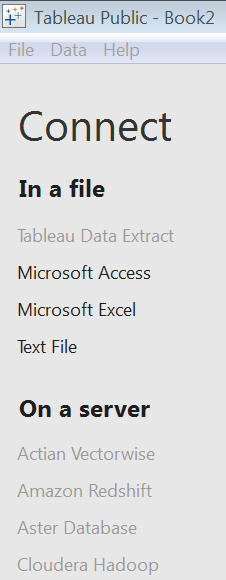
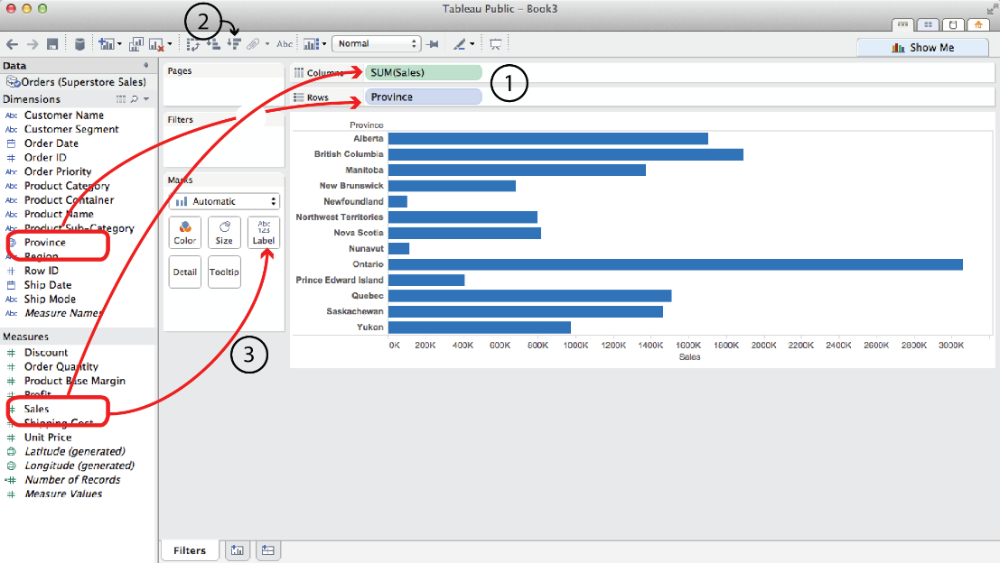
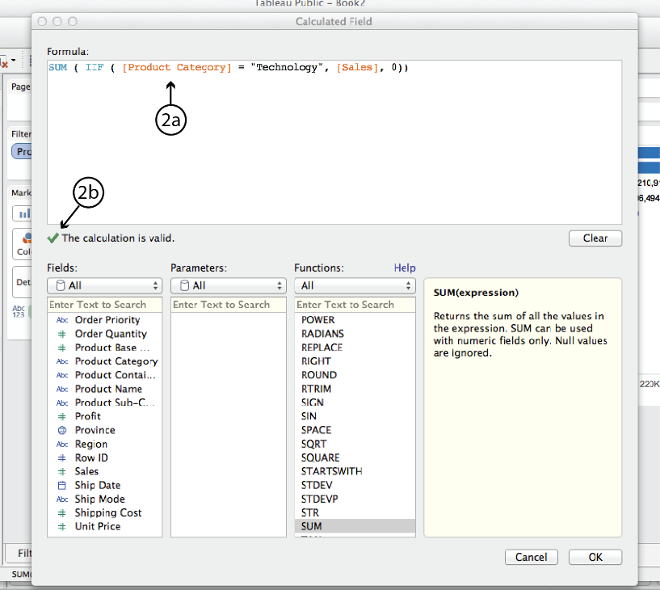
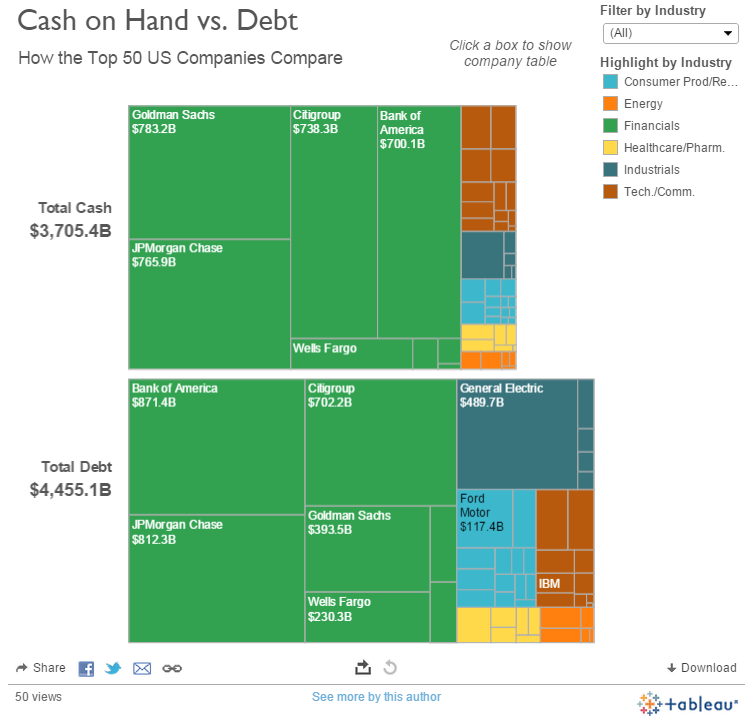
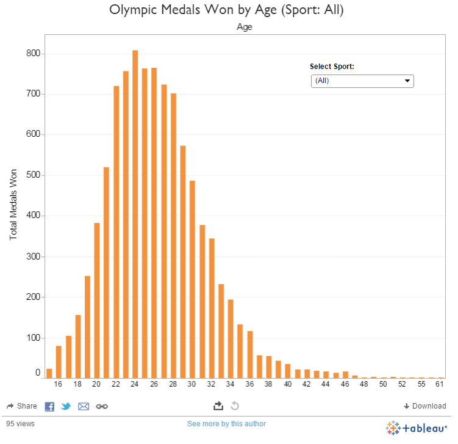
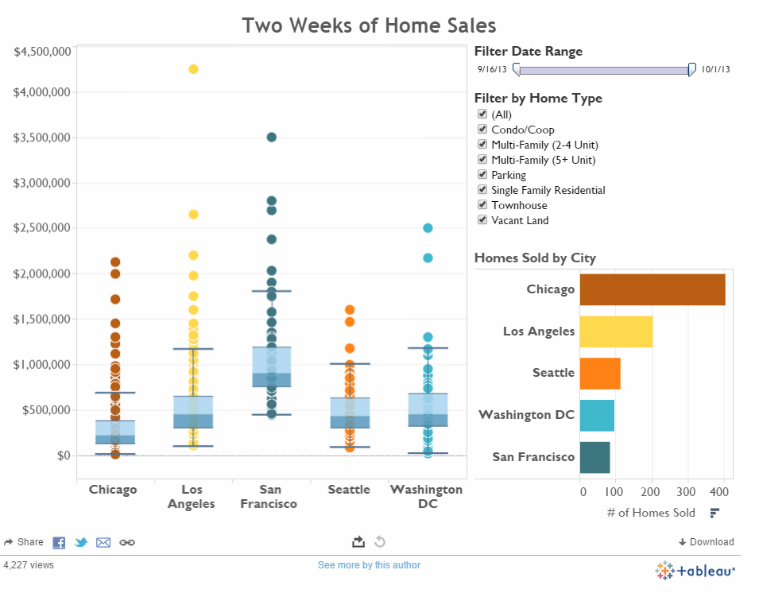
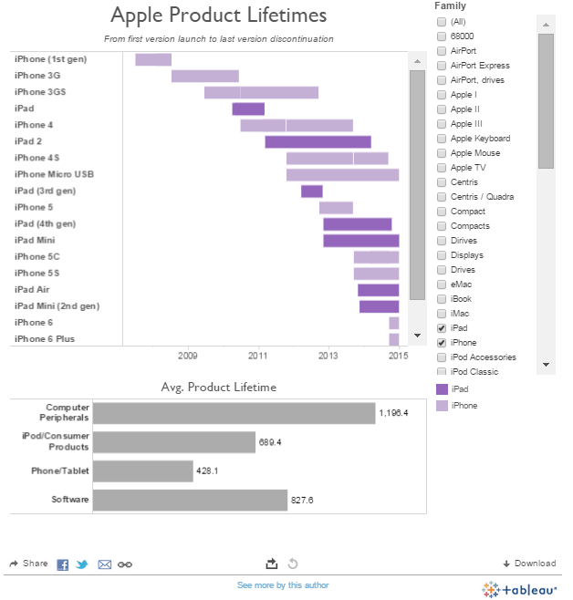
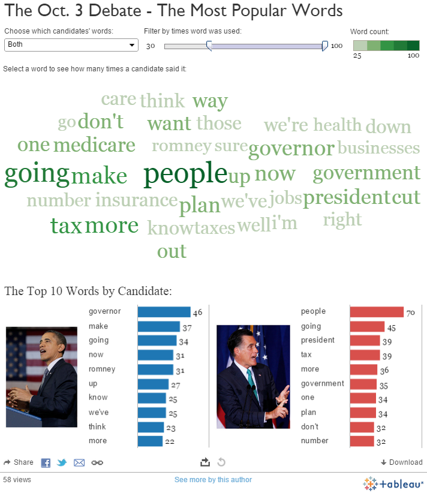
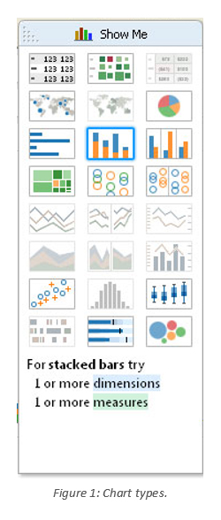
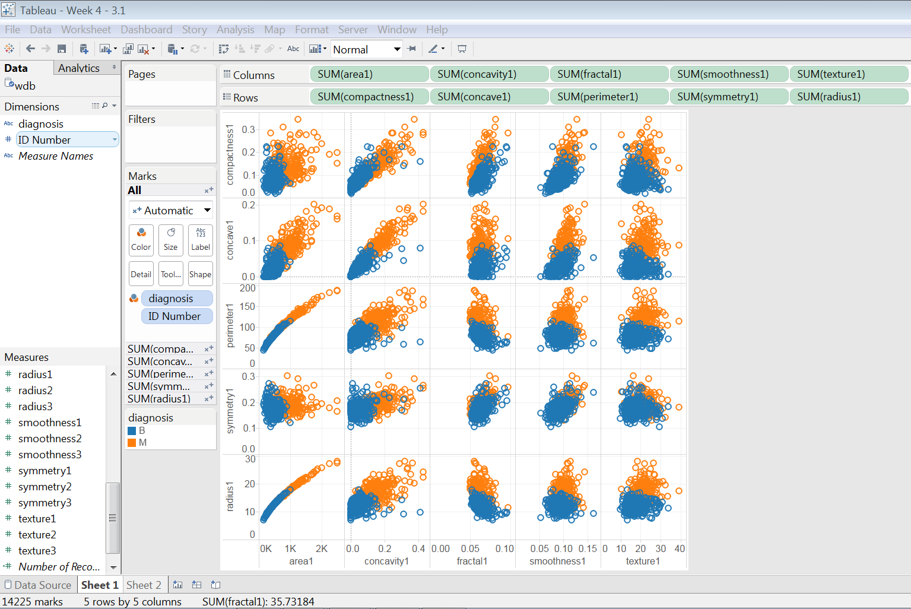

#  Visualizing Classification Models
Week 4 | Lesson 3.1

### LEARNING OBJECTIVES
*After this lesson, you will be able to:*
- Explain how to use Tableau for EDA visualization

### LESSON GUIDE
| TIMING  | TYPE  | TOPIC  |
|:-:|---|---|
| 5 min  | [Opening](#opening)  | Opening |
| 10 min  | [Introduction](#introduction)   | EDA - Exploratory Data Analysis  |
| 15 min  | [Demo](#demo)  | Demo  |
| 25 min  | [Guided Practice](#guided-practice)  | Tableau  |
| 25 min  | [Independent Practice](#ind-practice)  | Tableau and feature correlation  |
| 5 min  | [Conclusion](#conclusion)  | Conclusion  |

---

## Opening (5 mins)
- Review pre-work, projects, or exit ticket, if applicable
- Review current lesson objectives

## Introduction: EDA - Exploratory Data Analysis (10 mins)

In statistics, exploratory data analysis (EDA) is an approach to analyzing data sets to summarize their main characteristics, often with visual methods. A statistical model can be used or not, but primarily EDA is for seeing what the data can tell us beyond the formal modeling or hypothesis testing task.

EDA is a critical step in analyzing the data from an experiment. Here are the main reasons we use EDA:

- Detecting mistakes
- Checking assumptions
- Preliminary selection of appropriate models
- Determining relationships among explanatory variables
- Assessing direction and rough size of relationships between explanatory and outcome variables

Loosely speaking, any method of looking at data that does not include formal statistical modeling and inference falls under the term *exploratory data analysis.*

When first starting the Tableau software, you’ll be required to connect to a data source. There are many data source connectors available in Tableau as shown in the screen shot below:

# 

In class, we recommend using the Text File data source connector or pasting into Excel.

Once your data source has been selected and the corresponding file or connection setting specified, Tableau will try to make sense of the data (for databases, it will allow the selection of the specific table which contains the data that requires analysis / visualization).

Tableau will present a list of data fields as *Dimensions* and *Measures* which can be dragged and dropped as Columns and Rows, as shown on image as point 1.  

Point 2 shows how you can sort the data on the graph, and point 3 shows where you can use measures in the attributes of the graph.

# 

Tableau also has the ability to define calculated fields like Excel formulas, where you can use fields from your data as part of the calculated field as shown in 2a below.  Point 2b indicates whether the calculated field is valid.

# 

Below are examples of the types of graphs that Tableau can produce:

# 

Histogram

# 

Box Plot

# 

Gantt Chart

# 

Word Cloud

# 

In Tableau, there is an easy to use menu called “Show Me” which allows the type of chart you would like to visualize.  

Once it has been selected, it guides you through the Measures and Dimensions that are needed in order to visualize the selected chart.  Below is a screen shot of the “Show Me” menu.

# 

## Demo: Demo (15 mins)

>  Note: Open up Tableau and demonstrate how to connect to a Data Source and produce some simple scatter plots charts.

> Note: Demonstrate the difference between a dimension and a measure.

## Guided Practice: Tableau (25 mins)

Using Tableau we can start visually exploring the data to see which features correlate with malignant or benign tumors. We are using the [Wisconsin Diagnostic Breast Cancer (WDBC) data](./assets/datasets/)

The initial exploratory visualization is to determine whether there are visual correlations between the features which could be used in a machine learning model in predicting whether cells are malignant or benign.  This is best performed in Tableau using a scatter plot as shown below.

Orange means the tumor is malignant, blue means the tumor is benign.  As mentioned in the WDBC documentation, the first feature sets are mean averages and they are denoted here with their feature names ending with ‘1’.

# 

As we can see easily see above, there is no correlation between ‘symmetry’ and a number of features like ‘fractal’, ‘smoothness’, texture’.

Once we have identified features that don’t overlap (or don’t overlap as much), these make perfect candidates for a machine learning model.

## Independent Practice: Tableau and feature correlation (25 minutes)

> Note: Students should use Tableau to start visually exploring their project data to see which features correlate.

## Conclusion (5 mins)
- Review independent practice deliverable(s)
- Recap topic(s) covered

### ADDITIONAL RESOURCES

- [Tableau chart types](https://www.interworks.com/blog/ccapitula/2014/08/04/tableau-essentials-chart-types-introduction)
- [Build a Scatter Plot with Tableau](https://onlinehelp.tableau.com/current/pro/online/mac/en-us/buildexamples_scatter.html)
- [Scatter Plot Help](https://onlinehelp.tableau.com/v8.1/pro/online/en-us/buildexamples_scatter.html)
