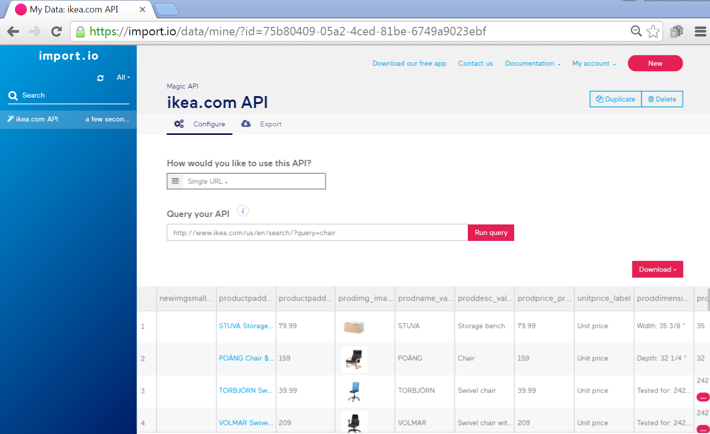
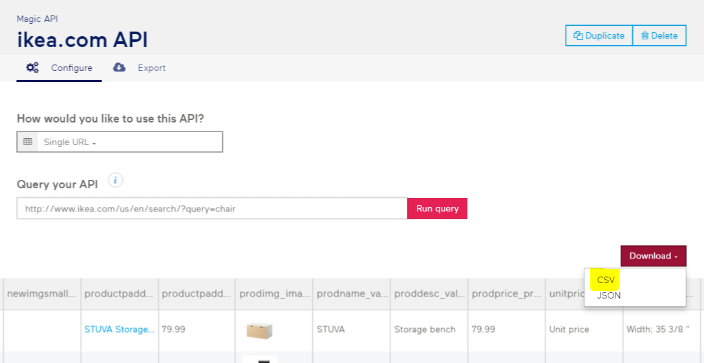
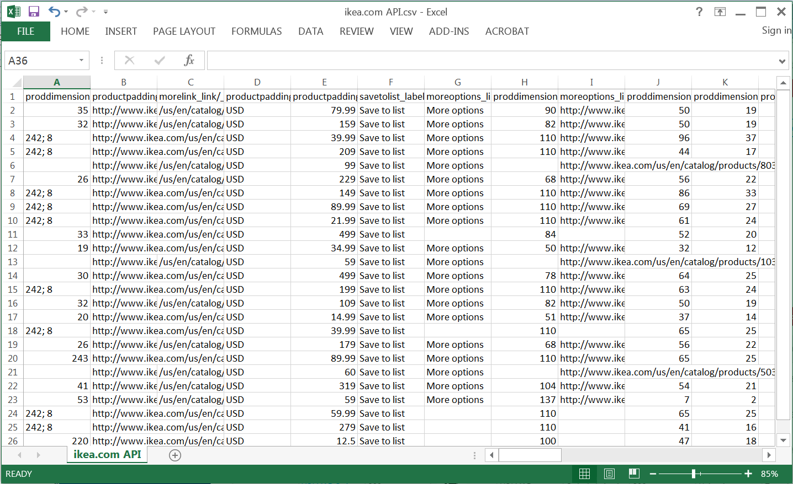

#  Speedy Scraping
Week 4 | Lesson 1.2

### LEARNING OBJECTIVES
*After this lesson, you will be able to:*
- Describe some concept of scraping
- Explain how to Web Scraping  works with some python code
- How it works with Scrape Project 4 dataset


### STUDENT PRE-WORK
*Before this lesson, you should already be able to:*
- a
- b
- c

### INSTRUCTOR PREP
*Before this lesson, instructors will need to:*
- Gather materials needed for class
- Complete Prep work required
- Prepare any specific instructions

### LESSON GUIDE
| TIMING  | TYPE  | TOPIC  |
|:-:|---|---|
| 5 min  | [Opening](#opening)  | Overview of what scraping is/does |
| 10 min  | [Introduction](#introduction)   | Explain what scraping is |
| 15 min  | [Demo](#demo)  | Python Library BeautifulSoup |
| 25 min  | [Guided Practice](#guided-practice)  | Import.io |
| 25 min  | [Independent Practice](#ind-practice)  | Import.io  |
| 5 min  | [Conclusion](#conclusion)  |  How it works with Import.IO |

---

<a name="opening"></a>
## Opening (5 mins)
- Review pre-work, projects, or exit ticket, if applicable
- Review current lesson objectives
- Reference general course content or topics (e.g. code or concepts that have been used across multiple lessons)
- Include Hook / Real-world Relevance (why the content from this lesson is useful or important)

> Instructor Note: Use instructor notes to talk directly to instructors. Otherwise, write out lesson directions and materials in a student-facing voice.

**Check:** Ask students to define, explain, or recall any **general** prior concepts or tools.

<a name="introduction"></a>
## Introduction: overview of what scraping is/does (10 mins)

Web scraping is a technique of extracting information from websites. It focuses on transformation of unstructured data on the web, into structured data that can be stored and analyzed.
Web pages contain a wealth of information (in text form), designed mostly for human consumption.

## Introduction to popular tools.

Python Library - BeautifulSoup
This library allows you to read a webpage and scan for HTML strings that are of interest to scrap certain values.  In this example, it scraps the date and sunrise times.


```python
import urllib2
from BeautifulSoup import BeautifulSoup
# or if you're using BeautifulSoup4:
# from bs4 import BeautifulSoup

soup = BeautifulSoup(urllib2.urlopen('http://www.timeanddate.com/worldclock/astronomy.html?n=78').read())
for row in soup('table', {'class' : 'spad'})[0].tbody('tr'):
tds = row('td')
print tds[0].string, tds[1].string

# will print date and sunrise

```

<a name="demo"></a>
## Demo / Codealong: Python Library - Mechanize (15 mins)

Python Library - Mechanize
This library also allows you to read a webpage and scan for HTML strings that are of interest to scrap certain values.  In this example, it scraps the news headlines and prints them every half an hour. Prints date and sunrise times. You can easily make this script to output the headlines to a file that can be analyzed later.


```python
import mechanize
import cookielib
import lxml.html as lh
import time  

br = mechanize.Browser()
cj = cookielib.LWPCookieJar()
br.set_cookiejar(cj)
br.set_handle_equiv(True)
br.set_handle_gzip(True)
br.set_handle_redirect(True)
br.set_handle_referer(True)
br.set_handle_robots(False)
br.set_handle_refresh(mechanize._http.HTTPRefreshProcessor(), max_time=1)
br.addheaders = [('User-agent', 'Mozilla/5.0 (X11; U; Linux i686; en-US; rv:1.9.0.1) Gecko/2008071615 Fedora/3.0.1-1.fc9 Firefox/3.0.1')]

while True:
    r = br.open('https://news.google.com/')
    html = r.read()
    doc=lh.fromstring(html)
    for i in doc.xpath('.//*[@class="esc-lead-article-title"]'):
        print i.text_content()
    time.sleep(1800)

end
```
## Introduction to Import.io

In this lesson we will be looking at a popular basic data extraction technique that can be used to extract date from webpages.

Import.io is the number one web data extraction platform. It can be accessed on the web at http://www.import.io. The technology is used in hundreds of global businesses worldwide and provides high-quality, scalable data from the web without too much effort.

Tools are free to create an API or crawl an entire website in a fraction of the time of traditional methods, no coding required. Highly efficient and scalable platform allows the processing of thousands of queries at once and get real-time data in any format. Also, data can be extracted by interacting with page searches and page clicks.

There’s also an easy to use client library which makes exporting, integrating and using the data as simple as extracting it.

Using import.io you can turn any website into a spreadsheet or an API in few minutes, and without writing program code.

There is a lot of data on the web, however some of this data is confined inside a webpage in certain formats, getting this data can be challenging without the right tools.

When working with information coming from web pages, data scientists notice there are far more pieces of information than just text. Shopping websites contain prices, hotel booking sites contain dates, and there are many images on the web.

An API is one way to get that data, however that is not always available, therefore, import.io allows data scientists to take advantage of all of these different data types when there is a need to extract data from web pages.

Data types are automatically cleaned and standardized to a data set, which means that import.io provides you with better data for a single data source that is consistent data between multiple sources.


**Check:**

<a name="guided-practice"></a>
## Guided Practice: Topic (25 mins)
> Teachers Note: Open up web page and demonstrate using import.io on www.ikea.com

Let’s say we would like to extract all the chairs on sale at the IKEA website store.

Import.io can extract the data via API using an API query as shown below. This page allows for the adjustment of the API query so that 'chair' can be specified.  You can immediately see the results of the API when the ‘Run query’ button is pressed.





When happy with the results, press the ‘Download’ button and pick the file format for downloading the data. In this case, CSV has been selected.





The data is immediately downloaded and as shown below Excel can be used to open up the CSV data file.





Please open the website http://www.import.io and check out the documentation and pick a website to scrap using the tools.

**Check:**

<a name="ind-practice"></a>
## Independent Practice: Topic (25 minutes)

- Create an account on import.io
- Set up a new "magic" extractor for reddit.com
- Download the first page from import.io
- Load the downloaded csv file into python with pandas
- Examine and clean the dataset in pandas


<a name="conclusion"></a>
## Conclusion (5 mins)
- Review Web scraping technique
- Recap topic(s) covered
- Cover homework and/or any upcoming tasks

***


### ADDITIONAL RESOURCES

- API: https://import.io/data/mine/?id=37bbe05d-c52d-4e01-85c1-b0ef67e74f0f
