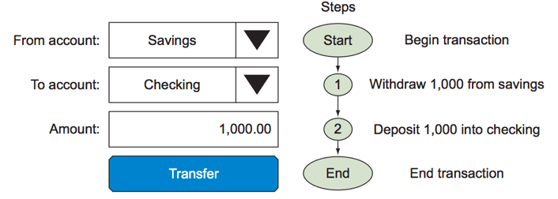

#  Database Fundamentals
Week 5 | Lesson 1.1

### LEARNING OBJECTIVES
*After this lesson, you will be able to:*
- Explain RDBMS fundamentals
- Describe what SQL and noSQL mean
- Describe tradeoffs between SQL and noSQL
- Identify remote vs local database instances

### STUDENT PRE-WORK
*Before this lesson, you should already be able to:*
- Student should be familiar with CSV and json files
- Students should be familiar with Pandas Dataframes and Python dictionaries
- Students should be able to transfer data to/from Pandas from/to CSV and json

### INSTRUCTOR PREP
*Before this lesson, instructors will need to:*
- Read in / Review any dataset(s) & starter/solution code
- Generate a brief slide deck
- Prepare any specific materials
- Provide students with additional resources
- Make sure that the postgreSQL instance is running ok

### LESSON GUIDE

| TIMING  | TYPE  | TOPIC  |
|:-:|---|---|
| 5 min | [Opening](#opening) | Opening |
| 15 mins | [Introduction](#introduction) | Intro to Relational Databases |
| 10 mins | [Guided](#guided_practice_1) | Design a relational database |
| 15 min | [Introduction](#introduction_2) | Alternative databases |
| 10 mins | [(Optional) Guided-practice](#guided-practice_2) | (Optional) Find the most appropriate storage |
| 10 mins | [Demo](#demo_1) | Connecting to a Local Database |
| 10 mins | [Demo](#demo_2) | Connecting to a Remote Database |
| 10 minutes | [Ind-practice](#ind-practice) | Independent Practice |
| 5 mins | [Conclusion](#conclusion) | Conclusion |

## Opening (5 min)

Up to this point, we have used DataFrames, sourced from CSV and sometimes json files.

Mainly these solutions lack
- Fault tolerence 
- Performance / Scalability
- Interactive Features

Databases are the standard solution for data storage and are much more robust than text, CSV or json files. Most analyses involve using data in some format and in most settings, a database is the tool of choice.

Databases can come in many flavors, designed to serve for different use cases. We will survey few applications and explore the most common families of databases: Relational (RDBMS) and non-Relational (noSQL).

**Check:** What is a Pandas DataFrame?

**Check:** Who has used relational databases vs non-relational databases (noSQL)?

## Prevalence Databases

_Circa December 2015 - Indeed.com: Frequency of Skill Terms related to "Data Scientist"_

<img src="data:image/png;base64,iVBORw0KGgoAAAANSUhEUgAAAqMAAAHcCAYAAADiA6PhAAAABHNCSVQICAgIfAhkiAAAAAlwSFlz%0AAAALEgAACxIB0t1+/AAAIABJREFUeJzs3XuYXWV5///3QBwgzBAzsiMQhkQCudWCh59FAhUUBEGp%0AIChFUDQeGrGtigrSqHxFUfBQD/liKwdBEQpaqLVgi/gF5aAlKB7wFO/QaDyAOIMzDJlGC0nm98de%0A0SHkMJnsvdbee96v65pr9uy9Dve6vdRPnv2sZ3WNjY0hSZIkVWG7qguQJEnS1GUYlSRJUmUMo5Ik%0ASaqMYVSSJEmVMYxKkiSpMtOqLkCbNnfu3LFvf/uHVZcxpcycOZ3h4dVVlzGl2PPy2fPy2fPy2fPy%0A1Wq9XZPZz5FRaZxp07avuoQpx56Xz56Xz56Xz563D8OoJEmSKmMYbWErV66sugRJkqSmcs5oC1u+%0AfDlDQ6NVlzGlDA/32POS2fPy2fPy2fPytUPP+/vn0N3dXXUZlZuyYTQi/i4zP7mZz/cDZmbm7RFx%0ANfCqzHxkI9vNBI7OzKsj4izga5n57UbUeOriq5g+Y1YjDiVJklrI6pEBlpx5LPPm7Vt1KZWbsmEU%0AeBewyTAKvAz4DXB7Zp68me2eDhwLXJ2ZH2pgfUyfMYuembMbeUhJkqSWMiXCaETMBz4DPEJ9nuxN%0AQF9EfBJYDFwKzAD2AP4RuA5YCPwhIr4LXAMEcAzwjuI49wEvpx5qnxYRfw0cDHweuK04315AN/B3%0AwNAGNZySmb9u8qVLkiS1tKlyA9MRwNLi93uAfwWGMvPvgH2oj2oeBRwFvC0z76MeHD9WfOU+Vhzn%0A5cCHM/MQ4MvALsD7qX81f8m4850G/CwzDy72OXAjNcxo4vVKkiS1hSkxMkp95PMs4CvAg8C7x302%0AAJweEScAD/Gnnmy4cOsY8DZgcUS8GVgGfGkj2wHMB24AyMz/BpZExA7jahgB3rmlou+45myOXHTZ%0ARK5PkiS1mb6+Hmq13qrLqNxUCaPHUZ/7+b6IeDn1ULje24E7MvPCiDiM+lfxAGuB8SvmdgGLgHMy%0AczAiLgSOB37OY0eYlwEHANdFxN7Ae4Hrx9VwclHDaxt6lZIkqW0MDY0yOLiq6jIaZrLBeqqE0buA%0AyyPiYerB8W3AnIj4HHAZcEFEHA/8GFgVEd3Ad4CPRMQy6qOiY8C3gC9HxCpgFfWAuROwf0S8pTjX%0AGHARcFlE3EI90L6F+ojs+Bre2vzLliRJam1dY2NjW95Kldhh58ePHXzSeVWXIUmSGqwTl3aa7LPp%0Ap8rIaFuqzezh/EULqi5jSunra/1FkjuNPS+fPS+fPS9fO/S8v39O1SW0BMNoC5s2bVpH/YupHdRq%0AvR01f6cd2PPy2fPy2fPy2fP2MVWWdmpLPptekiR1OsOoJEmSKmMYlSRJUmUMo5IkSaqMYVSSJEmV%0A8W76FrZ8+fKWX5ai0wwPt/5SIJ3GnpfPnpevqp7398+hu7u79PNKW8MwOgkRcSgwnJk/jIj7M3O3%0AZpxn/2c+Gxe9lyRNRicuqq7OZBidnNcCVwM/pP74z6bo2m57embObtbhJUmSKmcYHSciFgJHA7sW%0AP1cDJ2TmgcXnXwA+WmzzjIj4CbBDRPwzsBfwO+BlQA9wJdBLvcfvzsyvR8QPgFuAp1EPscdl5kOl%0AXaAkSVKL8QamRxsDtsvMI6gHzr8BHo6Ip0REHzA3M78F3AC8IzN/RT14Ls7MQ4AZwDOBdwM3ZuZz%0AgROBS4vj9wJXZebzgHuBF5Z3aZIkSa3HkdHHuhkgM++PiGHgU8BrgF8AV2xk+6HM/GXx+n5gOvBk%0A6iOjZOZ9EfFQRMwqtvle8ftXwI7NuQRJkurPZ6/VeqsuozJT+drbiWH0sQ4ALoqIJwI7A18C3gE8%0AQP0reIB1wPbF643NGV0GHAJ8PyJmA4+n/hX+praXJKnhhoZGp+zz2X02ffkmG/79mv6x9o2Im4Dr%0AgdMyczVwK/DbzHyw2OZO4PyIeDKPDZdjwHnA4RFxK/BvwKLMXLuJbTfpoBPP3bYrkSRJanGOjD7W%0AdZn50Q3e2w64ZP0fmXkxcHHx5x7j3j953D7Hb3jgzNx73OvFWypk9cjABEuWJOnR/P8QtQvD6GM9%0AarQyIm4EBjPzlrILueL8U1yYumR9fS4GXjZ7Xj57Xr6qet7fP6f0c0pbq2tszCmMLWzM+S7lco5R%0A+ex5+ex5+ex5+ex5+Wq13q7J7OecUUmSJFXGMCpJkqTKGEZb2Ny5c6suQZIkqakMo5IkSaqMYVSS%0AJEmVMYxKkiSpMq4z2sLWrFnDihX3VF3GlDI87PqLZbPn5WvXnvf3z6G7u7vqMiQ1mGG0SSJiJTA/%0AMx/ezDY/zMz9N/X54PAoiy9e2oTqJKm9rB4ZYMmZxzJv3r5VlyKpwQyjzTMGTGrx1/UOPuk8embO%0AblA5kiRJrccw2gARsRA4Gti1+Hlv8dGnIuJJxevjgYeBK4ttVgDbl1upJElSa/EGpsYYA7bLzCOo%0Ah9JPUA/6n87Mw4CVwJHAacCPM/NQ4IOAk58kSdKU5sho49wMkJn3R8SDwL7Ad4rP7gemAwH8Z7Fd%0ARsRgFYVKUjvq6+uhVuutuoxJa+fa25U9bw+G0cY5ALgoIp5IPXgOUh8xHe8nwF8A/x4R86h/XS9J%0AmoChoVEGB1dVXcak1Gq9bVt7u7Ln5Zts+Pdr+sbZNyJuAq4D3gis3eDzMeBCYHZEfIP6vNKhckuU%0AJElqLY6MNs51mfnRcX/vvf5FZi4e9/4rJnrA//rCOzn4pPMaUZsktbXVIwNVlyCpSQyjjbPhV/Lb%0ArDazh/MXLWj0YbUZfX3tuRh4O7Pn5WvXnvf3z6m6BElNYBhtgMy8vBnHnTZtmgs8l8w5RuWz5+Wz%0A55JaiXNGJUmSVBnDqCRJkipjGJUkSVJlDKMtbOXKlVWXIEmS1FSGUUmSJFXGu+lb2PLly9ty+ZV2%0ANjzcnkvetDN73lj9/XPo7u6uugxJmjDDaAs7dfFVTJ8xq+oyJLWJ1SMDLDnzWJeEk9RWDKMViYjP%0AAldn5o2b2mb6jFn0zJxdXlGSJEklc85odcZowlObJEmS2okjow0WEfOBzwCPUA/7rwTeA+wH/BLY%0AJzOfWWzetblj3XHN2Ry56LImVitJklQtw2jjHQEsBc4CDgFeDeyUmQdGxO5AVlmcpM7W19dDrda7%0Axe0mso0ay56Xz563B8No411KPYh+BRgB7gbuBMjM30TETyqsTVKHGxoa3eJz5302ffnsefnsefkm%0AG/6dM9p4xwG3Z+YRwLXAQuA5ABExE/A2V0mSpIIjo413F3B5RDxMPeyfAJwUEf8F/Bb4w7htN3sD%0A09i6tYwO39u0QiV1ltUjA1WXIElbzTDaYJn5M+pzRcf7/voXEbGs2O41WzpWbWYP5y9a0NgCtVl9%0AfS7AXjZ73lj9/XOqLkGStophtHwTXs7p17/+tfNdSuYco/LZc0ma2pwzWrLMfGrVNUiSJLUKw6gk%0ASZIqYxiVJElSZQyjkiRJqoxhVJIkSZUxjLawuXPnVl2CJElSU7m0Uwtbs2YNK1bcU3UZU8rwsGte%0Als2eT0x//xy6u7urLkOSGs4w2sIGh0dZfPHSqsuQVLHVIwMsOfNY5s3zacKSOo9htIV1bbc9PTNn%0AV12GJElS0xhGKxARC4HXAl3AezLza9VWJEmSVA3DaHV+l5nHV12EJElSlQyj1RgDlm9po4NOPLeE%0AUiS1g76+Hmq13oYdr5HH0sTY8/LZ8/ZgGK3OuqoLkNQ+hoZGGRxc1ZBj1Wq9DTuWJsael8+el2+y%0A4d91RqszVnUBkiRJVXNktAKZeflEtls9MtDsUiS1Af+3QFInM4y2sCvOP8XFwEvW1+cC7GWz5xPT%0A3z+n6hIkqSkMoy1s/vz5zncpmXOMymfPJWlqc85oC/PZ9JIkqdMZRiVJklQZw6gkSZIqYxiVJElS%0AZQyjkiRJqox307ewNWvWsGLFPVWXMaUMD7vMUNk6tef9/XPo7u6uugxJanmG0RY2+8DXs/jipVWX%0AIWkrrR4ZYMmZxzJv3r5VlyJJLW9Kh9GIWAhEZi7eyv1+mJn7N6eqP5k+YxY9M2c3+zSSJEmVmepz%0ARn0+vCRJUoWm9MhoYUFE3AjUgE8Bw8DfAI+jHlaPL967EHga8CtgF4CImAtcBmxfbPvmzPxBRLwC%0AeAvwv8A9wCLglcDRwK7FzzmZ+aVyLlGSJKk1TfUw2gU8kplHRcQc4D+BK4BjMvP3EXEhcBTwB2B6%0AZi6IiF2B/y72/wfg45l5fUQ8Hbg0Io4CzgGekZn/ExEfA94AjALbZeYREbEbsDQirsvMdWVesKRy%0A9PX1UKv1Vl3GJrVybZ3KnpfPnreHqR5Gx4DvFq9/C0wHBoHLI2IUeDJwBzAH+DZAZj4QEcuKfZ4M%0A3Fa8f3dE9AN7Az/OzP8ptrkNeAFwJ3Bzse39EfEg9RHSgaZeoaRKDA2NMji4quoyNqpW623Z2jqV%0APS+fPS/fZMP/VJ8zCo+eN/p44L3AScBfA7+nPnr6E+BggIiYCcwvtl8GHFq8/wzgN8DPgadGxPRi%0Am+cBWbw+oNj2icDO1IPvJt1xzdmTvypJkqQ2MNVHRuHRYXQEWEp9NHQAWA7snpmfjYjDIuJO4D7g%0A/mL7M4BLIuIM6nNMX5eZv4uI9wBfj4h11OeMngWcDOwbETdRn3N6WmZu9gaqsXVrGR2+t2EXKqkc%0Aq0f8wkOSJqprbMwbyssQEa8Gds3Mj050nz333HPs2muva2JV2lBfX2cuwN7KOrXnrbzovV9fls+e%0Al8+el69W6+2azH6OjJZrq5L/tGnTXDS7ZP6PV/nsuSRNbYbRkmTm5VXXIEmS1Gq8gUmSJEmVMYy2%0AsJUrV1ZdgiRJUlMZRiVJklQZw6gkSZIqYxiVJElSZbybvoUtX768I9dfbGXDw5255mUra9eet/I6%0AopLUTgyjkxQRRwF7ZeYlzTrHqYuvYvqMWc06vKRJWj0ywJIzj3UdYElqAMPoJGXmjc0+x91fvYAj%0AF13W7NNIkiRVxjA6SRGxEAjqT1X6c+AJwN2Z+dqI+Dbwssz8RUS8DHgO8BHgU8COwO7AuzPz3ysp%0AXpIkqUV4A9PkjQHdwHBmvgA4AFgQEXsAlwKvKrZbCFwMPBn4aLHtIuBvS69YkiSpxTgyum3GgFkR%0AcRUwCvRQ7+lVwO0R8Wlgl8z8SUR0Ae+KiNcV+z2uqqIlbbu+vh5qtd6qy5i0dq69Xdnz8tnz9mAY%0Anbwu4DDgnsx8eUTUgOOBrsx8KCK+A3wCWD/p833AJZn5lYh4DfDqSqqW1BBDQ6MMDq6quoxJqdV6%0A27b2dmXPy2fPyzfZ8O/X9JM3BnwL2DsivgYsAe4E9ig+vwQ4CvhC8fc1wD9ExA3AXkBfueVKkiS1%0AHkdGJ68bGMjMZ2/sw8y8A3j8uL8/D3x+3Cbv3dIJnv6CNzE6fO+21impwVaPDFRdgiR1DMPoJETE%0AC4E3A29o5nmuOP+UtlwMvJ319bXnAuztrF173t8/p+oSJKkjGEYnITNvAG5o9nnmz5/vfJeSOceo%0AfPZckqY254xKkiSpMoZRSZIkVcYwKkmSpMoYRlvY3Llzqy5BkiSpqQyjkiRJqox307ewNWvWsGLF%0APVWXMaUMD7fnMkPtrJ163t8/h+7u7qrLkKSOYhhtYYPDoyy+eGnVZUiivtD9kjOPZd68fasuRZI6%0AimG0hXVttz09M2dXXYYkSVLTOGdUkiRJlXFktIEiYiHwYmBHYHdgCXAcsB9wBnA8MA/YCViSmVdu%0A7ngHnXhuM8uVJEmqnGG08XbOzKMj4iTgrZm5ICKeB5wN7AUsKLZ7QVUFSpqcvr4earXeqstoiE65%0AjnZiz8tnz9uDYbSxxoDvF69HgGXF6weBh4G3ApcAuwCbHRWV1HqGhkYZHFxVdRnbrFbr7YjraCf2%0AvHz2vHyTDf/OGW28sU283wU8KzNPAP4S+HBE2H9JkjSlOTLaeGPjfo9t8N5uEfFNYC3wkcxcV3Zx%0AkiRJrcQw2kCZefm41zcCNxav7waO3trjrR4ZaFxxkraJ/32UpOYwjLawe+/8NNdee13VZUwpfX3t%0A8zSgTtFOPe/vn1N1CZLUcQyjLWzatGk+7aVkTngvnz2XpKnNG2gkSZJUGcOoJEmSKmMYlSRJUmUM%0Ao5IkSaqMYbSFrVy5suoSJEmSmsq76VvY8uXL22bJm04xPNzYZYb6++fQ3d3dsONJktRpDKPbICIW%0AApGZi8e9dzXwqsx8ZFuPf+riq5g+Y9a2HkYVWT0ywJIzj3V5LkmSNsMwum0e8xz6zDy5UQefPmMW%0APTNnN+pwkiRJLccwuu0WRMSNQA24EFgM7A98D3haZv4+Is4A1gD/ClwE7AT8HliUmb+upmxJkqTq%0AeQPTtukCHsnMo4DjgdOpj5Y+Qj14vqzY7mTgc8A/AP83Mw8DPgp8sPSKJUmSWogjo9tmDPhu8fq3%0AwHRgXfH+p4FPRcRPgZ9m5lBE7A+8MyLOoh5kH97cwe+45myOXHRZ04pX8/X19VCr9VZdRsuzR+Wz%0A5+Wz5+Wz5+3BMLrtNpw32gWQmf8dEV3AmcA/FZ8tA/4hM++IiP2AA8srU1UYGhr1uetb4LPpy2fP%0Ay2fPy2fPyzfZ8G8Y3XZjG7we//elwHsz85bi7zOoj5buSH3e6JtLqVCSJKlFGUa3QWZePu71H4An%0AbfD51cDV4/7+OXD0RI8/tm4to8P3NqBSVWH1yEDVJUiS1PIMoy2sNrOH8xctqLqMKaWvr/GL3kuS%0ApE0zjLawadOmuWB6yZxjJElSuVzaqYX5bHpJktTpDKOSJEmqjGFUkiRJlTGMSpIkqTKGUUmSJFXG%0Au+lb2PLlyxu6zJC2bHh425d26u+fQ3d3d4MqkiSpsxlGW9j+z3w2B590XtVlaCusHhlgyZnHuiSX%0AJEkTZBhtsojYAXhlZl4aEecAv8nMiyayb9d229Mzc3ZT65MkSaqSc0abb3fg9cXrsc1tKEmSNNU4%0AMroVImIh8GJgR+ohcwlwHLAfcAawF3A8sDPwQPH6XcBTI+Ls4jDHRcSJwBOAszPzy2VegyRJUisx%0AjG69nTPz6Ig4CXhrZi6IiOcBbwXuAo7IzLGI+ApwAPB+YL/MPLf4mv7XmbkoIp4LvAMwjHaYvr4e%0AarXeqstoK/arfPa8fPa8fPa8PRhGt84Y8P3i9QiwrHj9INANPAJcHRGjwJ7U+9u1wf7fKV7/Fpje%0A7IJVvqGhUZ9vvxVqtV77VTJ7Xj57Xj57Xr7Jhn/njG69Tc373AF4SWa+HHgz9d52Aev4U5+7NrHv%0ARh104rmTrVGSJKktODK69cbG/R7/+hFgNCJuoz5f9LvAHsBSoDsiPgj8nkeHWW9okiRJU5phdCtk%0A5uXjXt8I3Fi8vhs4ajO7PnMjx/opcPjmzrd6ZGByhaoy/mcmSdLWMYy2sCvOP8UnMJWsr68xT2CS%0AJEkTYxhtYfPnz3fydcmc8C5JUrm8gUmSJEmVMYy2sLlz51ZdgiRJUlMZRiVJklQZw6gkSZIqYxiV%0AJElSZbybvoWtWbOGFSvuqbqMKWV4ePJLO/X3z6G7u7vBFUmS1NkMo9soInYAXpmZl0bEOcBvMvOi%0ATWz7WeCCzPzOxj7f0ODwKIsvXtqwWtU8q0cGWHLmscybt2/VpUiS1FYMo9tud+D1wKVs+fGeW/X4%0Az4NPOo+embMnW5ckSVLLM4yOExELgRcDO1IPmUuA44D9gDOAvYDjgZ2pP3/+eOBdwFMj4uxxx9kO%0AuBjYszjOdZm5/vPFETET6AL+OjNXNP/KJEmSWpM3MD3Wzpl5DPAh4I2ZeQKwCHgdMBM4IjMXUA/y%0ABwDvB36SmeeOO0Y/cEdmHg0cCJw27rMbM/P5wEeADzf9aiRJklqYI6OPNgZ8v3g9AiwrXj8IdAOP%0AAFdHxCj1Uc9p1Ec4NzQEHBARhwEPFfuud2vxeyn1QKoO0dfXQ63WW3UZbcm+lc+el8+el8+etwfD%0A6GNtal7nDsBLMnNBREwH7qIeRNfx2BHmhcCDmXlaROxDfWSVYvsFwHLgUODuBteuCg0Njfpc+0mo%0A1XrtW8nsefnsefnsefkmG/4No481Nu73+NePAKMRcRv1+aLfBfagPsLZHREfBH5fbHszcFVEPAv4%0ABXBXROxRfPb8Ym7qI8BrS7kiSZKkFtU1NrZVN3irRDvs/Pixg086r+oyNAEu7TR5jl6Uz56Xz56X%0Az56Xr1br3djUxS1yZLSF1Wb2cP6iBVWXMaX09W3boveSJGnrGEZb2LRp0xxpK5n/kpYkqVwu7SRJ%0AkqTKGEYlSZJUGcOoJEmSKmMYbWErV66sugRJkqSmMoxKkiSpMt5N38KWL18+6WWGNDnDw/Wlnfr7%0A59Dd3b3lHSRJ0jYxjLawUxdfxfQZs6ouY8pxAXtJkspjGC1RRNwCvCEzcyLbT58xi56Zs5tblCRJ%0AUoWcM1qu8c+7lyRJmvIcGd2CiJgPfAZ4hHp4vxj4K2BH4InApzLzwoh4LvB/im16gFOKfa4HHgD+%0AszhkV0S8GHgr8JLMfGhT577jmrM5ctFlTbkuSZKkVuDI6JYdASwtfr8HmAHsCrwQOAg4IyJqwFOB%0AV2bmYcAXgROpj4I+ETgyMz9SHO8E4G+BYzYXRCVJkqYCR0a37FLgLOArwAjwVeDWzFwLrI6IHwF7%0AA/cB/zciRoHZwDeK/X+emWvGHe/5QC8w/j21mL6+Hmq13qrLmDLsdfnsefnsefnseXswjG7ZccDt%0Amfm+iDgZ+ACwAiAipgNPAe4BrgP2zsz/iYjP8qdR53UbHO9vgFOB9wGLm1++JmNoaJTBwVVVlzEl%0A1Gq99rpk9rx89rx89rx8kw3/fk2/ZXcB74uIm4E3ABcAu0TE/wNuA96bmUPAlcDtEfFl6nNEdy/2%0A39gNS+8Djo6Ig5tevSRJUgtzZHQLMvNnwCHr/y5uVNo7M9+0wXZv38QhDh63zWHj3n/mls49tm4t%0Ao8P3bl3B2marRwaqLkGSpCnDMDo5pSzP9MPvfcsnMJWsr+9PT2CSJEnNZxjdSpl5K3BrGeeaP3++%0A811K5hwjSZLK5ZxRSZIkVcYwKkmSpMoYRiVJklQZw6gkSZIqYxhtYXPnzq26BEmSpKbybvoWtmbN%0AGlasuKfqMjpaf/8curu7qy5DkqQpyzA6SRHxSeCaYqmnphgcHmXxxUubdfgpb/XIAEvOPJZ58/at%0AuhRJkqYsw+jkNX3h+67ttqdn5uxmn0aSJKkybR1GI2Ih8GJgR+rPgl8CHAfsB5wB7AUcD+xM/Xnx%0AxwOvAI4Gdi1+zsnML0XEj4AE/hc4DbgM6CtO9ebM/FFEnAYsAgaKY15b1BCZuTgidgSWZeaTIuJA%0A4OPU5+XeW5x336LGLuB3wGsz86HmdEeSJKn1dcINTDtn5jHAh4A3ZuYJ1APj64CZwBGZuYB68D6A%0A+ojmdpl5BPVQ+omI2J56uHxfZp4CvAu4KTMPB94AfCoiasDpwIHAi/jTyOimRkgvAl5TnPvLwFOA%0Ai4G/KZ5RfwPwjgb2QZIkqe209cgo9SD4/eL1CLCseP0g0A08AlwdEaPAnsDjis9vBsjM+yPiQeoj%0ApFAfGQXYHzgsIk4q/p4J7EN91PMRgIj45kbq6Rr3+omZmcV5PlPs8xTqwZailuWbu7iDTjx3cx+r%0AAfr6eqjVeh/13oZ/q/nsefnsefnsefnseXto9zAKmx6Z3AF4SWYuiIjpwF38KSweAFwUEU8EpgOD%0Axfvrit/LgLsy8+qImA2cAtwD/FlE7AT8AXg28JXi9e7Ffv/fuPPfFxH7ZOZ/R8SZxf4/BU7NzF9H%0AxKHAE7bpyrXNhoZGH/Usep9NXz57Xj57Xj57Xj57Xr7Jhv9OCqNjG7x+BBiNiNuozxf9LrBH8fm+%0AEXETsAv1r/bXRcT4UPsB4NKIWFRs857MfCAi3g98Axgqjj9GPZC+MSJuB75DfYQW6l/vXxYR64D7%0AgE8AvwSuiIhpxb6vbWAfJEmS2k7X2FjTbwpvKRHxamDXzPxo1bVsyYEvPWds+oxZVZfRsTa2tJP/%0Aki6fPS+fPS+fPS+fPS9frdbbteWtHqsTRkYnoy0S+BXnn8LQ0GjVZXS0/v45VZcgSdKUNuXCaGZe%0AXnUNEzV//nz/VSdJkjpaJyzt1LF8Nr0kSep0mxwZjYjnspmvszPztqZUJEmSpCljc1/Tn0k9jO4O%0AzAe+BqwBngf8ADi82cVJkiSps20yjGbmXwJExI3A0zJzZfH37sCVpVQnSZKkjjaROaN7rQ+ihfuB%0A2c0pR5IkSVPJRO6m/1ZEXAl8nnp4PRX4elOrEgBr1qxhxYp7qi6jJfT3z6G7u7vqMiRJUoNNJIz+%0ANfAm6k8UGgP+H/CpZhalutkHvp7FFy+tuozKbWxxekmS1BkmEka/nJkvAFr+iUWtJCIWAk/Ylic9%0ATZ8xi56ZzoiQJEmdayJzRneKiL2aXknnaYunPEmSJFVpIiOjNWBlRAwAvy/eG8vMvZtXVsc4KiJe%0ABPQA5wDPob401jTgXzPzw9WVJkmSVL2JhNGji9/jR/q6mlBLp+kCBjLzlRExC7izeO9Q6isSLKyw%0ANkmSpJYwkTD6S+A04PnF9l8DLmhmUR1iDLgNIDMHImIEeDPwIWA34IYKa2s7fX091Gq9pZyrrPPo%0AT+x5+ex5+ex5+ex5e5hIGP0wsA9wGfU5pq8BngSc3sS6OkEXsAC4OCJmA7sAJ2TmyRHRBfw4Iq7O%0AzF9t6gB3XHM2Ry66rKRyW9vQ0CiDg6uafp5arbeU8+hP7Hn57Hn57Hn57Hn5Jhv+JxJGXwA8MzPX%0AAkTEl4EfTepsU8sY8ISIuBnYmfrX8s+NiKXU597euLkgKkmSNBVMJIxuX2y3dtw+a5pWUYfIzMuB%0Ayzd4+zbg3IkeY2zdWkaH721oXe1o9chA1SVIkqQmmUgY/Wfgloi4ivpXzycDVze1KgFQm9nD+YsW%0AVF1GS+jvn1N1CZIkqQkmEkb/Avgc8OfAg8D7M/M/mlqVAJg2bZpPHZIkSR1tIoven0v97u/9gcOB%0AgyLC4TpiQnoqAAAgAElEQVRJkiRtsy2G0cxcmpnvAY4BLqF+N/1tzS5MsHLlyqpLkCRJaqotfk0f%0AEf9E/av6tdRD6BsxjEqSJKkBJvI1/YxiuwSWAT/NzAebWpUkSZKmhIl8Tf+KzNwfeB/QDfxHRLje%0AkCRJkrbZRL6mfzL1R4E+H3gG9Wesezd9CZYvX87Q0GjVZTRVf/8curu7qy5DkiRVZCJLO/0L9fD5%0AMeCO9U9i0sRExGeBqzPzxq3d99TFVzF9xqzGF9UiVo8MsOTMY12+SpKkKWyLYTQzn1ZGIR1srPjZ%0Aand/9QKfTS9JkjraREZGp7yImA98BniE+jzbU4C/Bw6gPo/2PcCXgYuBPYHdgesy8+xxx+gFLqV+%0AQ9gewD9m5oUlXoYkSVLLmcjd9IIjgKXF7/cAC4G+zDwQOIz606n6qU9jOBo4EDht3P5dwD7Uv64/%0ACjgKeFtp1UuSJLUoR0Yn5lLgLOArwAjwLerhlGKZq/8TEbsAB0TEYcBDwA4bHGMAOD0iTig+f1xJ%0Atbe0vr4earXeqst4lFarZyqw5+Wz5+Wz5+Wz5+3BMDoxxwG3Z+b7IuJk4APANwEiYgZwNXAD8GBm%0AnhYR+wCLNjjG26iPnF5YBNZjyiu/dQ0NjTI4uKrqMv6oVuttqXqmAntePntePntePntevsmGf8Po%0AxNwFXB4RD1Of2vBS4DURcTv1Hp4D/Aq4KiKeBfwCuCsi9ij2HwOuBy6IiOOBHwOrIuJxmflIuZci%0ASZLUOgyjE5CZPwMO2eDt721k02ds5L3XjHu9/9ac9+kveBOjw537fIHVIwNVlyBJkipmGG1hV5x/%0AypRY9F6SJE1dhtEWNn/+fOe7SJKkjubSTpIkSaqMYVSSJEmVMYxKkiSpMobRFjZ37tyqS5AkSWoq%0Aw6gkSZIqYxiVJElSZVzaqYWtWbOGFSvuqbqMpurvn0N3d3fVZUiSpIoYRrcgIj4JXJOZt27i8/2A%0AmZl5e0RcDbyqUY/4HBweZfHFSxtxqJa0emSAJWcey7x5+1ZdiiRJqohhdMvGtvD5y4DfALdn5smN%0APHHXdtvTM3N2Iw8pSZLUUpoWRiNiIfBaoAv4JPAWYC3wjcxcHBE14HJgRrHNq4AHgCuB3qK2d2fm%0A1yPih8CtwNOAnwK/BQ4F/hd4EfBuYB6wK/AE4B+BlwLzgVdn5p0R8SbgZOrh8vOZeUFEfBb4AzAX%0A2B1YmJnfi4jTgEXAALAzcE1E9AKXFvXuUZzjOmAh8IeI+C5wTXHOPYDLgO2L8705M38QEfcA3wCi%0AuIaXZua6TfXwoBPP3aqeS5IktZtm38D0O+BY4P8Ah2fmIcDsiDiCeoD8Umb+BfB24NnFezdm5nOB%0AE6mHP4Ae4J8z81DgEOCbxTbdwJ9RD3yrM/OFwL8CL8rMY4EPAi+PiKcAfwX8BfUQ+5KImF/stzIz%0AjwYuABYVIfl04EDqQXeMeljeB7g6M48CjgLelpn3AZ8BPpaZ3x637T8AHy9qfMu463gS9YB9MFAD%0ADmhIlyVJktpUM7+mHwOWUw9xNeCGiIB6sJxHfQTx0wCZeQdwR0ScAlxRvHdfRDwUEbOK4323+P0g%0A8JPi9TCw40Y+//G41zsC+wFzgK8V7z8eWD9R8XvF719RD6v7AMvWz/uMiG8Wnw8Ap0fECcBD/Kl3%0AXRu59icDtxXXcXdE9BfvP5CZ94473w4b2XdK6evroVbrrbqMR2m1eqYCe14+e14+e14+e94emj1n%0AdB3wc+rB64jMXBsRrwXuov5V9bOBH0bEocALgWXURy7vjojZ1EPj74pjbWnu5npdPDYgJvDjYuSU%0AiHgb8APq8z3H7wdwD/BnEbET9a/wnw18BXgbcEdmXhgRhwHHFNuvpf51/Hjrr+P6iHgG9TmlG7uG%0AjQXZKWVoaJTBwVVVl/FHtVpvS9UzFdjz8tnz8tnz8tnz8k02/Dc7jI5l5gMR8THgtojYnno4vQo4%0AD7gsIl5JPbS+Dhgp3nsZsBOwqAiwEwmiY+N+P+p1MV/z5oj4BvWR0qXAvRvbr6j3/dTndg4BjxSf%0AXQ9cEBHHUx95XRUR3cB3gI9ExLJx5z4DuCQizgAeV1zb+HNtWLMkSdKU1DU2Zh5qVQe+9Jyx6TNm%0AbXnDNtWKSzv5L+ny2fPy2fPy2fPy2fPy1Wq9k/rG16WdWti9d36aa6+9ruoymqq/f07VJUiSpAoZ%0ARlvYtGnTWmrUUJIkqdF8Nr0kSZIqYxiVJElSZQyjkiRJqoxhVJIkSZUxjLawlStXVl2CJElSU3k3%0AfQtbvnw5Q0OjVZfRMP39c+ju7q66DEmS1EIMoyWJiK8DL83MoYnuc+riq+iURe9bcYF7SZJUPcNo%0AubbqyQTTZ8yiZ+bsZtUiSZJUOcNoE0TELsAlwOOBPYB/Kj76RETMBlYDCzPzgYpKlCRJagnewNQc%0A84DPZ+ZRwAuAtxXvfy4zDwf+A1hcVXGSJEmtwpHR5hgATo+IE4CHqPd5DLil+HwpcMyWDnLHNWdz%0A5KLLmlVj6fr6eqjVeqsuY4vaocZOY8/LZ8/LZ8/LZ8/bg2G0Od4G3JGZF0bEYdSDZxdwEHAbcChw%0Ad4X1VWJoaJTBwVVVl7FZtVpvy9fYaex5+ex5+ex5+ex5+SYb/g2jzXE9cEFEHA/8GBgFuoFXRMR7%0AgWHg1RXWJ0mS1BIMo02QmbcA+2/rccbWrWV0+N5tL6gFrB4ZqLoESZLUggyjLaw2s4fzFy2ouoyG%0A6e+fU3UJkiSpxRhGW9i0adNcJF6SJHU0l3ZqYT6bXpIkdTrDqCRJkipjGJUkSVJlDKOSJEmqjGFU%0AkiRJlTGMSpIkqTIu7dTC9txzT6699rqqy9hm/f1z6O7urroMSZLUggyjJYiIq4FXZeYjW7Pf4PAo%0Aiy9e2qSqyrF6ZIAlZx7reqmSJGmjDKMlyMyTJ7Nf13bb0zNzdqPLkSRJahmG0QaLiIXA0cCuxc97%0AgY8BAewFfBZ4GPgFMDczD6ukUEmSpBbgDUyNNwZsl5lHUA+lnwC2B7qAjwDvz8zDgW9WV6IkSVJr%0AcGS0OW4GyMz7I+JBYP2EyScD/1W8/gbwigpqK11fXw+1Wm/VZUxYO9XaKex5+ex5+ex5+ex5ezCM%0ANscBwEUR8URgOjBYvP8j4GDgK8CCLR3koBPPbVqBZRoaGmVwcFXVZUxIrdbbNrV2CntePntePnte%0APntevsmGf8Noc+wbETcBvcAbgYupf31/FnBZRJwBjABbdXe9JElSpzGMNsd1mfnRcX/vDRARC4DX%0AZeaKiHg9WxgdXT0y0MQSy9EJ1yBJkprHMNocY5t4/1fA5yNiNbAGeN3mDnLF+acwNDTa6NpK198/%0Ap+oSJElSizKMNlhmXr6Zz26nPp90QubPn+98F0mS1NFc2kmSJEmVMYy2sLlz51ZdgiRJUlMZRiVJ%0AklQZw6gkSZIqYxiVJElSZbybvoWtWbOGFSvuqbqMrdbfP4fu7u6qy5AkSW3AMNrCBodHWXzx0qrL%0A2CqrRwZYcuaxzJu3b9WlSJKkNmAYbbKIuAV4Q2bm1u578Enn0TNzduOLkiRJahHOGW2+MTb9RCZJ%0AkqQpzZHRBoqIhcCLgJ2AecCHi4+6IuIcYC6wJ9AH/F1m/lf5VUqSJLUOw2jj7ZKZR0fEPsCXgfuK%0A98eAwcxcGBH7AVcCz6iqyGbq6+uhVuutuoxJa+fa25U9L589L589L589bw+G0cYaA75fvP41sMMG%0An98EkJk/iojdyiysTENDowwOrqq6jEmp1XrbtvZ2Zc/LZ8/LZ8/LZ8/LN9nw75zRxhs/P7Sr+Fnv%0A2QDFyOgvyixKkiSpFTky2nhjG7we//chEXETMB1YtKUD/dcX3snBJ53X4PKaa/XIQNUlSJKkNmIY%0AbaDMvHzc6z8AT1r/d0QAXJiZX5zo8Wozezh/0YKG1liG/v45VZcgSZLahGG0hU2bNs3F4yVJUkcz%0AjJYkM99bdQ2SJEmtxhuYJEmSVBnDqCRJkipjGG1hK1eurLoESZKkpjKMSpIkqTKGUUmSJFXGu+lb%0A2PLlyxkaGq26jI3q759Dd3d31WVIkqQ2ZxitSEQ8D3hDZp68qW1OXXwV02fMKq+oCVo9MsCSM491%0ADVRJkrTNDKPVGdvSBtNnzKJn5uwyapEkSaqEYXQzImIh8GJgR2B3YAlwHLAfcAbwysz8q2LbbwAn%0AAucB84CdgCWZeWVEvBR4FzAE/Bb4KrByS+e/45qzOXLRZY29KEmSpBbiDUxbtnNmHgN8CHhjZp4A%0ALAJeB+wXEY+PiD8DBoFVwCHA8cDRwNqIeBzwceDIzDwCcKKlJElSwZHRzRsDvl+8HgGWFa8fpB4q%0ArwROAZ4EXJqZoxFxOnAJsEvx+Uzgd5n5u2Lfm0uqvan6+nqo1XqrLqMpOvW6Wpk9L589L589L589%0Abw+G0S3b3NzOzwL/TP0r+bMiYjfgWZl5QkTsCPySeiCdHhG7Zeb9wIHALc0tufmGhkYZHFxVdRkN%0AV6v1duR1tTJ7Xj57Xj57Xj57Xr7Jhn+/pt+ysXG/xwfTscy8D3gIuDkz1xVhc7eI+Cb1eaEfycw1%0A1L/W/7eIuIn6KOqGx5YkSZqSHBndjMy8fNzrG4Ebi9ffB140btNLx233xo0c51bgIICIOGvce7du%0A7vxj69YyOnzvNlxBc6weGai6BEmS1CEMo5MUETsBt1MfFf3ZVu4+oRHRH37vWy296L0kSdK2MoxO%0AUmb+HvjzSez3oYluO3/+fOe7SJKkjuacUUmSJFXGMCpJkqTKGEYlSZJUGcOoJEmSKmMYbWFz586t%0AugRJkqSm8m76FrZmzRpWrLinknP398+hu7u7knNLkqSpwzDawgaHR1l88dLSz7t6ZIAlZx7LvHn7%0Aln5uSZI0tRhGW1jXdtvTM3N21WVIkiQ1jXNGJUmSVBlHRrdBROwCXAI8HtgD+DRwRGa+OCJeDizO%0AzKdHxF8ArwI+B3wUeBhYDbwsM1vzeZ+SJEklMIxum3nA5zPz3yJid+A2YHVEdAMvBNZGxCzgWOCL%0AwHHA54ElxXszgU2G0YNOPLfJ5W9aX18PtVpvZeev0lS97irZ8/LZ8/LZ8/LZ8/ZgGN02A8DpEXEC%0A8BD1ft4IHA7sCfwzcCRwCPBO4E7gXcDNwL3F3y1paGiUwcFVVZdRulqtd0ped5Xsefnsefnsefns%0AefkmG/6dM7pt3gbckZmnAtcCXcCXgL8H7ga+CrwJuCcz1wKvBD6bmYcDPwEWVVK1JElSi3BkdNtc%0AD1wQEccDPwZWAXcB84EPZuYPI6IfOL/Y/lvApyPif4C1bCGMrh4ZaFrhrXheSZI09XSNjY1VXYM2%0AYfny5WNDQ9Xc3zRVF733a53y2fPy2fPy2fPy2fPy1Wq9XZPZz5HRFjZ//nz/iyRJkjqac0ZbmM+m%0AlyRJnc4wKkmSpMoYRiVJklQZw6gkSZIqYxiVJElSZQyjkiRJqoxLO7Wwr371q6xYcc82HWOqrhcq%0ASZLag2F0nIhYBFyWmWtKOt/9mbnbpj4/dfFVTJ8xa9LHXz0ywJIzj2XevH0nfQxJkqRmMow+2mLg%0AcqCUMAps9vFX02fMomfm7JJKkSRJKl9HhdGIWAgcDexa/JwD/A9wLvAH4HfAa4Fu4AtAF7AjcBrw%0A58BuwNXACRHxT8CzgPuBJwEvBt4L9BU/fwmcBTwH2B74WGZeGxF/A7wKWAd8OzPfEhFPAS4DVgPL%0AgR0z8zVNbIUkSVJb6LQbmMaA7TLzCOqhdAlwEXB8Zj4PuBV4N3AA8ADwQuBvgZ0z81LqwfPlEXEc%0A0JeZBwKvA/rHHf/mzHwOcBAwNzMPAQ4H3hURM4CFwN9m5sHAsojYHvgo8J7MfD7wY7YwIipJkjRV%0AdNTIaOFmgMy8PyJGqYfT3xSf3Q58AHgHsC/w78AjwPvH7d8FPBm4ozjOAxHx03GfZ/F7f+BZEfH1%0A4u9pwFzgNcAZEfGk4hjbFe8vLba7ifqIayn6+nqo1XrLOl1HsF/ls+fls+fls+fls+ftoRPD6AHA%0ARRHxRGAHoCsidsvM+4HnUg+TzwN+k5lHRcRBwHnURzfXUQ+PPwJOBZZExExg/rjjrx/VXAZ8PTPf%0AEBHTgHcCK6gH29My838j4ivUR1DvBg4FvgwsmOiF3HHN2Ry56LLJ9OCPhoZGGRxctU3HmEpqtV77%0AVTJ7Xj57Xj57Xj57Xr7Jhv9ODKP7RsRNwC7AG4r3vhgR64Ah6l+jA3w+It5IvQfvLd67HfiPzDw8%0AIl4YEd+k/tX9auojqFCE0cy8PiKeFxG3AT3AFzNzNCJ+CNweEauAX1MfEf0ZcGlEnE59Duvvxh9L%0AkiRpqurEMHpdZn50g/du3sh2L9jwjcxcCBARAdyemX8XEU+gPlI6uOFNR5n59o0c41Lg0g3e/jVw%0AVHHsA6nfMEVm7rG5Cxlbt5bR4Xs3t8lmrR4ZmPS+kiRJZejEMNqI0cZfAR8qRjK3B96RmY9sYZ+t%0AMaEaazN7OH/RhL/V36j+/jnbtL8kSVIzdVQYzczLG3Sc1cBLGnGsjRz7TuDOiWw7bdo0F6yXJEkd%0ArdOWdpIkSVIbMYy2sJUrV1ZdgiRJUlMZRiVJklQZw6gkSZIqYxiVJElSZTrqbvpOs3z5coaGRh/1%0AXn//HLq7uyuqSJIkqbEMoy3s1MVXMX3GrD/+vXpkgCVnHutyT5IkqWP4Nf0kRcTHI6K/mee4+6sX%0A0DNz9h9/xgdTSZKkTuDI6CRl5lurrkGSJKndtWUYjYiFwGuBLuCTwFuAtcA3MnNxROwKXAV0Awkc%0Anpn7RsSPir//l/rz4S8D+orDvjkzfxQRnwHmATsBSzLzyoj4APA86v3618z8cETcAiwCBoArgd7i%0A83dn5tcj4gfALcDTqD/+8zhgB+ALRd07Aqdl5t1NaZIkSVIbaMswWvgd9UD6DeBZmfmHiPhcRBwB%0AHAN8MTMvLP5+QbHPzsD7MvPuiPgQcFOxzb7AZRHxQuAQ4MBi+/X7nQI8F7gfWFi8N0Y9VL4buDEz%0AL4iIPYp69qYeTq/KzDdHxJXAC4FVwAPAq4CnFvVslb6+Hmq13q3dTVvB/pbPnpfPnpfPnpfPnreH%0Adg2jY8ByYB+gBtwQEQA91Ec1nwx8ttj2Gxvsm8Xv/YHDIuKk4u+ZmTkaEacDlwC7UB/xBHgF8CFg%0AN+CGDY73ZOAKgMy8LyIeioj1kzu/V/z+FfWR0H8B9gX+HXgEeP/WXvjQ0CiDg6u2djdNUK3Wa39L%0AZs/LZ8/LZ8/LZ8/LN9nw3843MK0Dfk496B2RmYcBnwLuAH4EHFRst2Aj+wEsAz5e7PdK4PKI2I36%0AKOsJwF8CH46IbuDEzDwZOBxYGBF7jTveMuBQgIiYDTye+qgt1EPzeM8DfpOZRwEfAM6b5LVLkiR1%0AhHYOo2OZ+QDwMeC2iFgKHEl9xPSDwLER8TXg9cDDG9n/A8BfRcTXgeuAZZl5P7BbRHwT+Crwkcx8%0AGBgqjv816l/J/3J9DdQD5eERcSvwb8CizFzLY4PoGHA38PrinB9mC2H0oBPP3Yp2SJIktZ+usbEN%0AM1P7K+Z+DmbmXcWc0b/PzCOqrmtrHfjSc8ZcZ7Rcfq1TPntePntePntePntevlqtt2sy+7XrnNEt%0A+Tn1G5LWANsDb6q4nkm54vxTNvoEJkmSpE7RkWE0M38KHFx1Hdtq/vz5/qtOkiR1tHaeMypJkqQ2%0AZxiVJElSZQyjLWzu3LlVlyBJktRUhlFJkiRVxjAqSZKkynTk3fSdYs2aNaxYcc+j3uvvn0N3d3dF%0AFUmSJDWWYXQzImIhEJm5eBOfvxoYyszrm3H+weFRFl+89I9/u+i9JEnqNIbRzdvs46ky8/Jmnrxr%0Au+3pmTm7maeQJEmqlGF0nIjYCfgMsBfQDVw77rO3AycBa4DbMvPvI+Ic4DfAT4HTMvPkYtvfZObu%0AEfFZoK/4+UvgLOA51J8K9bHM/OPxN8Zn00uSpE7nDUyPdhrws8w8GHg58HuAiNgfOBE4qPhs34g4%0Ahi2MnBaf35yZzwEOAuZm5iHA4cC7ImJGk65DkiSpLTgy+mjzgRsAMvO/I2IE2A0IYGlmri22ux34%0As80cp2vc6yx+7w88KyK+Xvw9DZgD/GBrCuzr66FW692aXbSV7G/57Hn57Hn57Hn57Hl7MIw+2jLg%0AAOC6iNgbOBe4gvrX8G+PiO2BdcChwOeApxf7/QHYHSAi5lD/Wn699aOny4CvZ+YbImIa8E7gZ1tb%0A4NDQqM+rb6Jardf+lsyel8+el8+el8+el2+y4d+v6R/tImDviLgFuBz4OEBm/gj4F+CbwJ3AzzPz%0AS+P2uwt4MCKWAufw6JA5VhzjemA0Im4DvgWsy8zRpl6NJElSi3NkdJzM/7+9ew+ysr7vOP5GcImU%0AlUK6qMC60Fi+47Q29UIk1qiMWoiJ4iVGjXGimKJj0Nh4qZeoVRJpxsREW500RkPMNDpFEtQk3moT%0ANd5pHJs25ovgqECJgoviSoUVtn+cAxzW5bK7Z89zWN+vmZ3z3M7z/PY7v9397O95zvPkGuDULaz7%0ANuVwWqEBWFM+fX9sF+85o9P8Bd1pz+q3Xt/qvCRJ0o7OMNpD5XuQHg0c11fHWPr097nrrns2W9bc%0A3NJXh5MkSao5w2gPZeZsYHZfHmPQoEHe4F6SJPVrXjMqSZKkwhhGJUmSVBjDqCRJkgpjGJUkSVJh%0ADKN17OWXXy66CZIkSX3KT9PXsQULFtDauum++M3NLTQ0NBTYIkmSpOoyjNax0y79MUOGjQRKN7y/%0A4aJjvNWTJEnqVwyjvRARk4E9M/OWLtb9A7AMeAo4JjNndnf/Q4aNZOjw0b1upyRJUr0yjPZCZj6w%0AldUbnkn/PPB8bVokSZK0YzGM9kL5kaBTgJbM/Hh52ZPAyRXbHAqcnZmnRMQMSo8P/SNgBXBcZrbX%0AvOGSJEl1wjDaOx0VX1sVEQOAEcARmdkREfcDE4AntvSeJ+dcwZHTb9s4P2LEUJqaGnvdaG2dNa49%0Aa1571rz2rHntWfMdg2G0OgZsYXqjcgBtB+6IiDZgDN2sf2trG8uXv93zVmqbmpoarXGNWfPas+a1%0AZ81rz5rXXk/Dv2G0994ERkbETsCuwLiuNoqIfYCpmTkxIoYA8/E+r5Ik6QPOMNp7bwIPAc8Ci4AX%0AK9Z1VLwuBN6JiEcpXS/6G2CPGrZTkiSp7hhGe6cBWJuZZ3ex7uqK6UfKr4d3Z+cd69fRtnIpULrP%0AqCRJUn9jGO2hiPgkcB5wVl8do2n4UGZNn7hxvrm5pa8OJUmSVAjDaA9l5n3AfX15jCVLlnjxtSRJ%0A6tf8AI0kSZIKYxiVJElSYQyjkiRJKoxhVJIkSYUxjEqSJKkwhtE6NmbMGBYtenHj19q1a4tukiRJ%0AUlV5a6cKETEZ2DMzb6niPmcDd2TmA9197/KVbVz6vaeA0k3vb7joGD7ykT+rVtMkSZIKZxit0JPA%0AuB062PRY0G4ZsNNAhg4fXeXmSJIk1Q/DaIWIOB2YAowDXgXGAncCfwHsC/w8My+PiF8Bz5WXrQdO%0ABt4A/gUYQ+mZ8/dk5hUV+24EbgWGAaOAmzLzu7X4viRJkuqV14xubsMo5lhgGvBpYCbwd8CBwJkV%0A2/17Zh4G/AS4nFIIfTIzp5S3rXxe/QBgL0qn6ycDk4Gv9PH3IkmSVPccGe3aS5n5dkS0A69l5psA%0AEVF5uv2h8uvjwKeAVuBjETEJWAUM7rTP14HzI+L48vqdu9uoESOG0tTU2N23qZusce1Z89qz5rVn%0AzWvPmu8YDKM9dyDwGHAQ8FvgdGBlZp4VEXsB0ztt/xVKI6ffLQfWT23rAB8/ceZm862tbT6rvo81%0ANTVa4xqz5rVnzWvPmteeNa+9noZ/w2jXOrZj+ksRMZPSKOdpwGjgxxGxP/AKMD8iRlW8717gnyLi%0AOOB/gLcjYufMbO+rb0KSJKneGUYrZOYPgR9WzL8L/GnF/KiKzc/JzNaK+beAv+pit2dUTO/Tnfas%0Afuv1LqclSZL6C8NoHfvRrM/R2tq2cb65uaXA1kiSJFWfYbQHMnNSLY4zfvx4r3eRJEn9mmF0B7Z2%0A7VoWL36lqvtsbm6hoaGhqvuUJEnaEsNoHRs7dizPPvvbLa5fvPgVvnzdPQwZNrIqx/ORo5IkqdYM%0Aozu4IcNG7vCPDF21ahVPP/0ERx45peimSJKkGvMJTCrcwoUL+PWvHy26GZIkqQCOjKpb1qx5l2uv%0AvZrXXnuN9vZ2zjvvAu6+ey7Lli1l3br1nHTSqRx++JHMmDGdiy++nD33bGHevLtobW3lqKOO5qqr%0ALmO33XZn6dIl7L33n3PhhZdw++23sWjRQu69dx5HH31s0d+iJEmqIcNoHXvvvfdYtOjFjfP18OGi%0AefPmMmrUGK6+ehZLlizm4YcfZPjwEVx55UxWr17NtGmf54ADJjBgwICKd22aXrLkVb7znZsZPHgw%0An/3sVFpb3+ALXziTefPmGkQlSfoAMozWseUr27j0e08B9fPhosWLX2XixIMAGDOmmRUrVjBhwoEA%0ADBkyhHHjxrF06ZLN3tPRsenBVaNHN7PLLrsA8OEP/wlr17Zvtl6SJH2wGEarKCI+ChyTmTMj4g+Z%0AuXun9XMz84SI2Af448x8bGv7O+ika7f54aRqPplpe/bV0jKOF174HQcffChLly7hl798iIaGBg45%0A5DBWr36HRYsWssceo2loGMyKFcvZc88WFiz4PU1NpU/8bz5iCtDBwIEDDaSSJH1AGUarKDOfB54v%0Az74vXWXmCeXJE4BlwFbD6LY0N7dww0XH9GYXXe5za6ZOPZ5Zs65hxozpdHR08M1v3sjcuf/GOed8%0AkTVr1jBt2nSGDx/OZz5zEtdf/w1GjtydpqamjSH0/WF0AKNHj+GllxYyZ86dnHjiyVX9fiRJUn0b%0A4IjU9omI8cAPgHZKdyH4HHAJMAFoAK4CVgFnZeYpEbEsM/eIiGuBxsw8NyL+AOwHPAG8C3w+M+dv%0A6VZ+6kIAAAVLSURBVJiTpt3csWFktG3lUmZNn1j4afr+rqmp0ade1Zg1rz1rXnvWvPasee01NTV2%0AHnHaLt7aafsdATxVfr0KOB0YkZkHApOAA+g0GhoR1wEDM/Pc8qKOzPxfSqH2+q0FUUmSpA8CT9Nv%0Av1uBvwfuB94CnqEUTsnMN4ErI+Kwiu13A/YBFm1hf93+72HEiKE0NTV2923qJmtce9a89qx57Vnz%0A2rPmOwbD6PabCjyWmddExCnA14HHASJiGHAH8I2K7V/LzCkR8auImJyZD1SsW08PRqVbW9s85dDH%0APK1Te9a89qx57Vnz2rPmtdfT8O9p+u03H7gmIh4GplP6ENLKiHiM0mjpDeXtOjq9ngn8c0SMqFj2%0An8CMiDh0awd8cs4VVWy+JElS/XFkdDtl5kvAJzotfq6LTR8pbz+q/LoI2PCpow3LfgH8YlvH7Fi/%0AjraVS4Hq3sJJkiSpXhhG61jT8KHMmj5x4/y2brskSZK0ozGM1rFBgwZ5KydJktSvec2oJEmSCmMY%0AlSRJUmF8ApMkSZIK48ioJEmSCmMYlSRJUmEMo5IkSSqMYVSSJEmFMYxKkiSpMIZRSZIkFcYwKkmS%0ApML4ONA6ExE7ATcDfwmsAb6YmYuKbVX/FRG/Ad4qz74EzAJmA+uB/wa+lJnejLeXIuJA4B8zc1JE%0A7EUXNY6IvwWmA+8BX8vMnxfW4H6gU833Be4FXiyvvjkz51jz6omInYHbgBZgMPA14AXs631mCzVf%0AAvwMWFDezL5eRRExELgFGA90AGdTyiqz6UU/d2S0/hwLNGTmQcAlwLcKbk+/FREfAsjMSeWvM4Hr%0Agcsy8xBgADC1yDb2BxFxMaVfXoPLi95X44jYHTgXOAiYDMyKiIYi2tsfdFHz/YHrK/r6HGtedacC%0Ay8v9egpwE6Xf3/b1vtNVzfcDvmVf7zOfBtZn5sHAV4FrqUI/d2S0/vw1cD9AZj4dEQcU3J7+7KPA%0AkIh4gNLPwuXAfpn5aHn9fcDfAPMKal9/sRA4HvhReb6rGq8DHs/MdqA9IhZSOjswv9aN7Sc613x/%0AYHxETKU0Ono+8DGseTXNAe4qT+8EtGNf72td1Xx/IOzrfSMz746In5VnxwIrgSN6288dGa0/uwKr%0AKubXlU/dq/reAa7LzMmUTjX8a6f1bcCwmreqn8nMn1A6TbPBgIrptynVeFc2XS5RuVw90EXNnwYu%0AzMxDKV2OchXQiDWvmsx8JzPbIqKRUkj6Kpv/jbWvV1kXNb8ceAb7ep/KzHURMRu4gdLfzV7/Tjfk%0A1J9VlH5wNtgpM9cX1Zh+bgHlAJqZLwJvALtVrG8E3iygXf1dZX/elVKNO/f7Rkr/cas6fpqZz22Y%0ABvbFmlddRDQD/wHcnpl3YF/vc51qfif29ZrIzNOBAL4PfKhiVY/6uWG0/jwOHAUQEROB/yq2Of3a%0AGZSvyY2IUZR+WB6MiEPL6z8JPLqF96rnnuuixs8An4iIwRExDNib0oXwqo77I2JCefoISqfKrHkV%0ARcRuwIPAxZk5u7zYvt6HtlBz+3ofiojTIuLS8uz/UTodP7+3/dxrRuvPT4EjI+Lx8vwZRTamn7sV%0A+EFEbAicZ1AaHb2lfKH179h0PZJ6b8NdCS6gU43Ln7y8EXiM0j/Jl2Xm2oLa2Z9sqPnZwE0R0Q4s%0AA6aXT29a8+q5jNJpyCsj4srysi8DN9rX+0xXNT8f+LZ9vc/cBcyOiEeAnSn18d/Ty9/pAzo6vGuN%0AJEmSiuFpekmSJBXGMCpJkqTCGEYlSZJUGMOoJEmSCmMYlSRJUmEMo5IkSSqMYVSSJEmF+X86Drg+%0AdpSRRgAAAABJRU5ErkJggg==%0A">

## Intro to Relational Database Systems (RDBMS) (15 mins)

Databases are computer systems that manage storage and querying of data. Databases provide a way to organize data along with efficient methods to retrieve specific information.

Typically, retrieval is performed using structured query lanaguge (SQL), with many operators for conditional selection, aggregation, joining/merging, and data transformation.  **Many of these concepts we've explored using Pandas DataFrames!**

Databases allow users to create rules that ensure proper data management and verification.

### Industry example 1

Consider the case of a bank. It needs to keep track of all the money in each of its clients' accounts. Let's suppose that the bank stores these as numbers in a table with two columns:

| ACCOUNT_ID | CUSTOMER | BALANCE |
|---|---|
| 5234 | Jared | 10.000 |
| 2351 | Justin| 12.546 |
| 5521 | Snyder | 8761 |
|...|...|...|

**Check:** If this table was stored in a file in a central bank, how would internet banking look like? What problems could arise?

> Note:
> - consistency (what if two nodes try to read/edit the file at the same time?)
> - availability (what if a node is not connected to the central bank?)
> - partition tolerance (what if only part of the file is available?)
> - scale (what if too many nodes request data from the file at the same time?)

As you may have quickly understood, when multiple processes/users are interacting with the same data, it quickly becomes impractical to store it in a single file on a single machine. That's when a database comes in.

### Transactional Integrity
A unit of work performed against a database is called a _transaction_. This term generally represents any change in database.

Going back to the bank example, consider the case where you want to transfer money from an account to another.

**Check:** What happens if step 1 succeeds and step 2 fails ?

**Check:** What if you request the balance between step 1 and step2 ?

The system that stores the data must be resilient to these problems. It must know when a transaction begins, when it ends, what to do if it never ends and what to do if another transaction is requested, while the previous one is still going.

### ACID

The acronym ACID stands for Atomicity, Consistency, Isolation, Durability. This is a set of properties that guarantee that database transactions are processed reliably.

_Atomicity_ requires that each transaction be "all or nothing": if one part of the transaction fails, the entire transaction fails, and the database state is left unchanged.

_Consistency_ ensures that any transaction will bring the database from one valid state to another. Any data written to the database must be valid according to all defined rules, including constraints, cascades, triggers, and any combination thereof.

_Isolation_ ensures that the concurrent execution of transactions results in a system state that would be obtained if transactions were executed serially, i.e., one after the other.

_Durability_ ensures that once a transaction has been committed, it will remain so, even in the event of power loss, crashes, or errors. In a relational database, for instance, once a group of SQL statements execute, the results need to be stored permanently (even if the database crashes immediately thereafter)

This is the typical model under which _relational databases_ operate, and it fits perfectly our previous example of the bank.

### Relational Databases

A _relational database_ is a database based tabular data and link between data entities or concepts. Typically, a relational database is organized into _tables_. Each table should correspond to one entity or concept. Each _table_ is similar to a single CSV file or Pandas dataframe.

For example, let's take a sample application like Twitter. Our two main entities are Users and Tweets. For each of these we would have a table.

| TWEET_ID | USER_ID | TWEET_TEXT |
|---|---|---|
| 5234 | 1234567 | "Ate an entire pound of bacon this morning.  My arteries are ready to start the day." |
| 2351 | 4529234 | "Spock vs Chewbaka.  My definitive fan fiction chronicles a potential outcome." |
| 5521 | 2348902932 | "OMG Kardashians + Bieber convolutional network mashup madness." |
|...|...|...|

| USER_ID | USERNAME |
|---|---|
| 1234567 | "dyerrington" |
| 4529234 | "kieferk" |
| 2348902932 | "stoneyv" |
|...|...|

A table is made up rows and columns, similar to a Pandas dataframe or Excel spreadsheet. 

### A quick note on "Schemas"

The term **"schema"** can mean different things depending on which flavor of database you are talking about (MySQL, Postgres, Oracle, MSSQL).  Generally, the definition that we will accept for this class is:

>A **schema** is a collection of database objects which includes logical structures.

Including:

- Databases
- Tables
- Relationships Between Tables
- Keys and Indexes

We will talk more about these soon.

##  Back to Relational Databases...

A table can also be refered to as a _schema_ which defines how data will be managed and contained. 

Table schemas define:

- Column definitions
  - Type
  - Length
- Indexes
  - Unique constraints
- Keys
  - Auto-increment behavior
  - Relationships to other tables
    - Primary 
    - Foreign

These specify what columns are contained in the table and what _type_ those columns are (text, integers, floats, etc.).

The addition of _type_ information make this constraint stronger than a CSV file. For this reason, and many others, databases allow for stronger data consistency and often are a better solution for data storage.

Each table typically has a _primary key_ column. This column is a unique value per row and serves as the identifier for the row.

A table can have many _foreign keys_ as well. A _foreign key_ is a column that contains values to link the table to the other tables. For example, the tweets table may have as columns:
    - tweet_id, the primary key tweet identifier
    - the tweet text
    - the user id of the member, a foreign key to the users table

These keys that link the table together define the relational database.

MySQL and Postgres are popular variants of relational databases and are widely used. Both of these are open-source so are available for free.

Alternatively, many larger companies may use Oracle or Microsoft SQL databases. While these all offer many of the same features (and use SQL as a query language), the latter also offer some maintenance features that large companies find useful.

**Check:** Describe in your own words what a relational database is.

## Design a relational database (10 mins)

Consider the following dataset from Uber with the follow fields:
    - User ID
    - User Name
    - Driver ID
    - Driver Name
    - Ride ID
    - Ride Time
    - Pickup Longitude
    - Pickup Latitude
    - Pickup Location Entity
    - Drop-off Longitude
    - Drop-off Latitude
    - Drop-off Location Entity
    - Miles
    - Travel Time
    - Fare
    - CC Number

Work in pairs and answer the following questions:

- How would you design a relational database to support this data?
- List the tables you would create
- What fields would they contain?
- How would they link to other tables?

> Answer:
    Users table:
        - User ID
        - User Name
        - Joined Date
        - CC Number

>    Drivers table:
        - Driver ID
        - Driver Name
        - Joined Date

>    Locations table: Should store popular destinations metadata
        - Entity
        - Longitude
        - Latitude
        - Description

>    Rides:
        - Ride ID
        - Ride Time
        - User ID (link to users)
        - Driver ID (link to drivers)
        - Pickup Location Entity (link to locations)
        - Drop-off Location Entity (link to locations)
        - Miles
        - Travel Time
        - Fare
        - CC Number

## Alternative databases (15 min)

While relational tables are one of the most popular (and broadly useful) database types, specific applications may require different data organization. While it's not important to know all varieties, it is good to know the overall themes:

### Key-value stores
Some databases are nothing more than very-large (and very-fast) hash-maps or dictionaries that can be larger than memory. These are useful for storing key based data, i.e. storing the last access or visit time per user, or counting things per user or customer.

Every entry in these databases is two values, a key and value, and we can retrieve any value based on its key. This is exactly like a python dictionary, but can be much larger than your memory allows and uses smart caching algorithms to ensure frequently or recently accessed items are quickly accessible.  The ideal use case for a key-value store is ephermeral data.

Popular key-value stores include Cassandra, Redis, Kafka, and `memcachedb`.

Key-value stores are typically used for: image stores, key-based filesystems, object cache, systems designed to scale.

### NoSQL or Document databases
"NoSQL" databases don't rely on a traditional table setup and are more flexible in their data organization. Typically they do actually have SQL querying abilities, but simply model their data differently.

Many organize the data on an entity level, but often have denormalized and nested data setups. For example, for each user, we may store their metadata, along with a collection of tweets, each of which has its own metadata. This nesting can continue down encapsulating entities. This data layout is similar what we might expect in hierarchically structured data structures such as JSON, XML, or Python Dictionaries.

Popular databases of this variety include `mongodb` and `couchdb`.

Typical uses: high-variablity data, document search, integration hubs, web content management, publishing...

#### Industry example

Consider the case of large ecommerce website. There is a catalogue, with many products. Every product needs to be stored in a database, but different products could have different properties. Also, inventory needs to be tracked, and user carts affect inventory.

**Check:** What would be the shortcomings of the relational DB model?

> Answer:
> - schema: different products have different properties, a rigid schema makes it hard to add new products
> - scalability

#### Timeseries databases
Time series databases (TSDB) are optimized for handling time series data, i.e. data that is indexed by time (a datetime or a datetime range).

Examples of time series include stock market data, energy load data from a utility company, server metrics, purchase history, website metric, ads and clicks, sensor data from a wearable device or an internet-of-things sensor, smartphone sensor data, just to name a few..

Time series pose different challenges that cannot be usually solved with the traditional relational database model.

**Check:** What issues could arise when modeling time series data with a tabular data model?

> answer:
> - critical data volume
> - time ordering
> - out of order inserts
> - joins

Popular databases of this variety include: Atlas, Druid, InfluxDB, Splunk

Typical uses: financial data, metrics, energy monitoring...

#### Graph databases
Graph databases are optimized to store data about networks. Most graph databases are NoSQL in nature and store their data in a key-value store or document-oriented database. In general terms, they can be considered to be key-value databases with the addition of the relationship concept.

In traditional relational databases, the relationships are defined within the data itself. In graph databases, relationships allow the values in the store to be related to each other in a free form way. This allows complex hierarchies to be quickly traversed, addressing one of the more common performance problems found in traditional key-value stores.

Most graph databases also add the concept of tags or properties, which are essentially relationships lacking a pointer to another document.

Popular databases of this variety include: Neo4j, OpenCog, AllegroGraph, Oracle Spatial and Graph...

Typical uses: social networks, fraud detection, relationship-heavy data...

#### Industry example

Consider a phone company that has information about phone calls. Each phone call entity has the following properties:

- caller_id
- receiver_id
- time_of_call
- duration

Each user does several calls, and some users may be more connected than others. The company is interested in finding the people that are central in the network of call connections (super connectors), in order to extend them a promotion on their phone usage. The reason for doing this is that they want them to be happy with the company and positively influence the brand image to their connections.

A graph database is perfectly suited to answer such a question.

Other examples could include

- finding communities
- finding shortest path between two entities
- detecting fraudolent behavior
- establishing user identity

### BASE (Basically Available, Soft state, Eventual consistency)

- _Basically available_ indicates that the system does guarantee availability.
- _Soft state_ indicates that the state of the system may change over time, even without input. This is because of the eventual consistency model.
- _Eventual consistency_ indicates that the system will become consistent over time, given that the system doesn't receive input during that time.

Main concept: get rid of locks, allow everyone to write, worry about consistency later.

## (Optional) Find the most appropriate storage (10 mins)

In pairs or small groups iscuss the best storage or database solution for each scenario:

> Instructor Note: Many of these the answers may be personal preference, but students should understand some of the differences.

1. Database for an application with user profiles
>    - Probably relational DB. It could be a 'noSQL' database if user profile fields are commonly updating or we want to make it easy to do complex queries on user profile elements.

2. Database for an online store
>    - Probably a relational DB - Fast storage querying, standard table structures, transactional capabilities

3. Storing last visit date of a user
>    - A fast key-value store would be useful for caching interesting statistics about users (last visit, total visits)

4. Mobile application that allows peer to peer sharing of messages that have short lifetime.
>    - Probably a graph database for users and a noSQL or key-value store for messages

5. A hedge fund that needs to record stock market data and run models on them.
>  - a time series database

## Connecting to a Local Database (10 mins)
A database can be local or remote, it can span a single machine or it can be distributed with replicated data over several machines. The latter configuration is called _sharding_.

Let's start by connecting to a local _sqlite_ database.

### SQLite

**[SQLite](https://sqlite.org/)** is a database software package built on the Structured Query Language [(SQL)](https://en.wikipedia.org/wiki/SQL).  It is similar to other SQL databases, such as [PostgreSQL](http://www.postgresql.org/), [MySQL](https://www.mysql.com/), Oracle, and Microsoft SQL Server, except that it is *file-based*, rather than *server-based*.  This makes it easy to setup and use for small projects, but less suitable for production environments.  Once you are familiar with sqlite, the same ideas, and similar syntax, can be applied to other SQL databases.

SQLite v3 is bundled with most python distributions (including our Anaconda distribution).  You might also find it useful to install [SQLite Manager](https://addons.mozilla.org/en-US/firefox/addon/sqlite-manager/?src), a Firefox add-on for viewing SQLite database files via a simple GUI.

#### Interacting with SQLite
There are multiple ways of interacting with an SQLite database, including:

1. SQLite Command Line Utility
2. python `sqlite3` package
3. `pandas` SQL Interface
4. High-level ORMs (e.g. sqlalchemy, django ORM, etc.)

Let's start with method 1. All of these methods provide some form of wrapper, or set of convenience functions, for interacting with SQLite.  Behind the scenes, the Structured Query Language (SQL) itself defines the interface to the database software.  This underlying SQL syntax will be visible to a greater or lesser degree depending upon the method that is chosen.

#### Common SQL Command Patterns
The SQL command set has a rich syntax with numerous options, but most of the commonly used commands follow a few simple patterns.  A basic familiarity of these patterns is helpful when working in SQL:

    CREATE TABLE ...
    ALTER TABLE ... ADD COLUMN ...
    INSERT INTO ... VALUES ...
    UPDATE ... SET ... WHERE ...
    SELECT ... FROM ... WHERE ...
    SELECT ... FROM ... JOIN ... ON ...
    DELETE FROM ... WHERE ...

### 1. SQLite Command Line Utility

The first method we'll explore is connecting to SQLite via the built-in [command line utility](https://www.sqlite.org/sqlite.html).  

> Note: the commands in this section should be executed within your normal terminal shell.

To start a new session of the interpreter, simply open your terminal and type `sqlite3`, followed by the name of the database file.  If the file does not yet exist, sqlite will create it.

    $ sqlite3 test1.sqlite

    SQLite version 3.7.12 2012-04-03 19:43:07
    Enter ".help" for instructions
    Enter SQL statements terminated with a ";"
    sqlite>

Notice that your terminal prompt changes to `sqlite>`, indicating that you are now entering commands into the sqlite command line utility.  Take a quick look at the help command:

    sqlite> .help
Display the current databases - you should see the new file `test1.db`:

    sqlite> .databases

#### Creating tables and adding columns
Create an table called `table1` with a single column `field1` containing an INTEGER PRIMARY KEY:

    sqlite> CREATE TABLE table1 (field1 INTEGER PRIMARY KEY);

Add a few more columns to `table1`:

    sqlite> ALTER TABLE table1 ADD COLUMN field2 VARCHAR(16);
    sqlite> ALTER TABLE table1 ADD COLUMN field3 REAL;
    sqlite> ALTER TABLE table1 ADD COLUMN field4 TEXT;

Notice the different field types in the ALTER TABLE commands.  SQLite supports several different [field types](https://www.sqlite.org/datatype3.html), including INTEGERS, variable length VARCHAR character fields (with a max length), TEXT fields, and 'REALS', which are used to store floating point numbers.

Verify that the table was created:

    sqlite> .tables

You can check the `schema` of the table using `.schema`, which shows the commands that would be needed to create the database tables from scratch.  

    sqlite> .schema

Notice that in this case, our `table1` could have been created with a single command, rather than adding each column separately.

#### Adding data
Let's add some data:

    sqlite> INSERT INTO table1 VALUES (1, 'Henry James', 42, '75 Mission Street, San Francisco, CA');
    sqlite> INSERT INTO table1 VALUES (2, 'Carol James', 40, '75 Mission Street, San Francisco, CA');
    sqlite> INSERT INTO table1 VALUES (3, 'Jesse James', 12, '75 Mission Street, San Francisco, CA');

Notice that the first column has unique values - this is a requirement for the PRIMARY KEY column.  If we try to add a record using an existing PK value we'll get an error:

    sqlite> INSERT INTO table1 VALUES (3, 'Julie James', 10, '75 Mission Street, San Francisco, CA');
    Error: PRIMARY KEY must be unique

Fortunately, SQLite has some built in functionality to auto-increment the PK value - just set the value of the PK field to NULL when doing the INSERT and it will automatically be set to a valid value.

    sqlite> INSERT INTO table1 VALUES (NULL, 'Julie James', 10, '75 Mission Street, San Francisco, CA');

Now that we have some data, take a look at the database using the **SQLite Manager** Firefox plugin.

1. Firefox -> Tools -> SQLite Manager
2. Select Connect Database
3. Highlight the table and then click the Browse and Search tab

Notice that the value in `field1` for the Julie James record has been automatically set to 4.

#### Updating records
Suppose we need to update an existing record with new data - e.g. maybe Julie James is only 9.  For this we use the UPDATE command:

    sqlite> UPDATE table1 SET field3=9 WHERE field1=4;

#### Removing Records
To remove records use the DELETE command:

    sqlite> DELETE FROM table1 WHERE field2 like '%Jesse%';

Use SQLite-Manager to verify that the Jesse James record has been removed.  To exit the sqlite interpreter type `.exit`.

    sqlite>  .exit

## Connecting to a Remote Database (10 mins)

> Update with AWS configuration settings

### Postgresql

**[Postgresql](http://www.postgresql.org/)** is a very powerful SQL based relational database.

#### PostgreSQL syntax

GA provides a PostgreSQL database instance at the following address:

You can connect to it using:

    psql -h dsi.c20gkj5cvu3l.us-east-1.rds.amazonaws.com -p 5432 -U dsi_student titanic
    password: gastudents

PosgreSQL accepts the same syntax as sqlite, with exception of a few system commands. Here are the most common:

- `\q`: Quit/Exit
- `\c __database__`: Connect to a database
- `\d __table__`: Show table definition including triggers
- `\dt *.*`: List tables from all schemas (if `*.*` is omitted will only show SEARCH_PATH ones)
- `\l`: List databases
- `\dn`: List schemas
- `\df`: List functions
- `\dv`: List views
- `\df+ __function` : Show function SQL code.
- `\x`: Pretty-format query results instead of the not-so-useful ASCII tables

Suggestions:
- if run with `-E` flag, it will describe the underlaying queries of the `\` commands (cool for learning!).
- Most `\d` commands support additional param of `__schema__.name__` and accept wildcards like `*.*`

### Comparison

|Task|MySQL|PostgreSQL|SQLite|
|---|---|---|---|
|Connect to a database|mysql &lt;dbname&gt;| psql &lt;dbname&gt;|sqlite3 &lt;filename&gt;|
|Client help|help contents|\?|.help|
|SQL help|help contents|\h|n/a|
|List databases|SHOW DATABASES;|\l|.databases|
|Change database|USE &lt;dbname&gt;|\c <dbname&gt;|n/a|
|List tables|SHOW TABLES;|\dt|.tables|
|Show table|info DESCRIBE &lt;tablename&gt;|\d &lt;tablename&gt;|.schema &lt;tablename&gt;|
|Load data|LOAD DATA INFILE &lt;file&gt; |\i &lt;file&gt;|.import &lt;file&gt; &lt;table&gt;|
|Export data|SELECT ... INTO OUTFILE &lt;file&gt;|\o &lt;file&gt;|.dump &lt;table&gt;|
|Exit the client|quit (or exit)| \q|.exit|

## Independent Practice (10 minutes)

Now that you are able to connect to a local or remote database try some of the following:

- create a new table in the database
- add data
- remove data
- alter tables
- list tables
- list schemas
- create a new database
- drop a table
- drop a database
- read the help

## Conclusion (5 mins)
Relational databases are the most common. They organize data into tables. Other database types exist, including graph, hash, documents and time-series specific databases.
The simplest local database is _sqlite_ and we learned how to add and remove data from it.
We also learnt how to connect to a remote _postgreSQL_ database and few basic _SQL_ commands.

### ADDITIONAL RESOURCES

- [Database page on Wikipedia](https://en.wikipedia.org/wiki/Database)
- [Database tutorials](http://www.tutorialspoint.com/database_tutorials.htm)
- [Postgres Cheat Sheet](https://gist.github.com/Kartones/dd3ff5ec5ea238d4c546)
