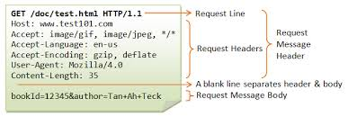
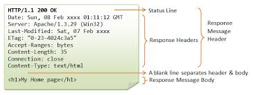

#  Web Services & APIs
Week 6| Lesson 1.3

### LEARNING OBJECTIVES
*After this lesson, you will be able to:*
- Identify all the HTTP Verbs & their uses.
- Describe APIs and how to make calls and consume API data.
- Access public APIs and get information back.
- Read and write data in JSON format
- Use the `requests` library

### STUDENT PRE-WORK
*Before this lesson, you should already be able to:*
- use a web browser
- know what a web server is

### INSTRUCTOR PREP
*Before this lesson, instructors will need to:*
- Read in / Review any dataset(s) & starter/solution code
- Generate a brief slide deck
- Prepare any specific materials
- Provide students with additional resources
- Shot of Vodka

### LESSON GUIDE

| TIMING  | TYPE  | TOPIC  |
|:-:|---|---|
| 5 min | [Opening](#opening) | Opening |
| 15 min | [Introduction](#introduction) | Introduction |
| 15 min | [Demo](#demo) | Demo: HTTP |
| 10 min | [Introduction](#introduction_2) | JSON |
| 10 min | [Ind-practice](#ind-practice_1) | Independent Practice: Validate JSON |
| 15 min | [Guided-practice/](#guided-practice/) | Guided Practice: Pulling data from API |
| 10 min | [Ind-practice](#ind-practice_2/) | Independent Practice: Python APIs |
| 5 min | [Conclusion](#conclusion) | Conclusion |

<a name="opening"></a>
## Opening (5 mins)

In previous classes we learned about building processes that scrape content from web-sites.  In this lesson we will be diving into the world of API's, but more specifically we will be taking a tour of one of the most accessible sources of data on the internet.


## First, What is an API?

An API (Application Programming Interface) is a set of routines, protocols, and tools for building software applications. It specifies how software components should interact.

APIs are a way developers abstract functionality to data, devices, and other resources they provide. 

Some examples include:

- Connectivity to a variety of databases
- Python modules that can turn LED lights on and off
- Application that runs on native Windows, OSX, or Linux
- Libraries that post content on Twitter, Facebook, Yelp, or LinkedIn
- Web services for accessing currency or stock prices

More abstract examples:
- Adding your own functions to Numpy itself
- Extending Python with C code
- Testing Frameworks

In the context of data science, APIs are a very common method to interact with data hosted by third parties and most commonly provided by Web Service API's

### Famous APIs:  Facebook

Facebook provides an API for interacting with their service.  At a glance:

- View your posts
- View websites, people, posts, pages that you've liked
- View activity on apps from you and your friends
  - Movies watched
  - Music listened
  - Games played
- View places traveled / check-ins
- Relationships

Potential Project Ideas:

|   |   |   |   |
|---|---|---|---|
| Determining Latent Characteristics | Friends Activity | Political Classification | Text Mining |
| Friend Classifier | Trending Topics | Recommenders | Feature Importances |
| Taste Profiling | Hipster Detector | Sub-group Identification | Checkin-Prediction |
| Relationship Forcasting | Relationship Classification | Sentiment Analysis | Popularity Projection |
| Personal Analytics | Friend Similarity Prediction | N-Gram Analysis | Topic Modeling |

### Famous APIs:  Yelp

Yelp provides a way for developers to access:

- Reviews
 - Services
 - Restaraunts / Bars / Cafes
 - Businesses
- Business meta-data

Potential Project Ideas

|   |   |   |   |
|---|---|---|---|
| Topic Modeling | Text Mining | Sentiment Analysis | Funny / Cool / Interesting Classification | 
| Music Genre Classification | Parking Index Classification | Characteristics Profiling | Hipster Index |
| Ideal Activities | Friend Recommender | Venue Recommender | Sports Bar Classifcation |
| Where is the best [whatever] in [neighborhood] | | |

### Famouse APIs:  Echonest

Echonest consolidates access to many entertainment service APIs in one place.  It has a huge list of features and connected services including:

- Spotify
- Pandora
- Rdio
- Gracenote
- SoundHound
- Shazam

Some Echonest features include:

- Music waveform identification (like Shazam, Soundhound music ID)
- Playlist recommendations
- Detailed artist, album, and track lookup
 - Bio / Origins / Contemporaries / Noteworthy Accomplishments
 - Official twitter / website / social media links
 - BPM / Mood / Popularity / Genre(s) 
 - Images / Videos / Media
- Detailed movie, actor, product lookup
- Concert Schedules and ticket metadata


## Web API's 

The prevelance of web API's have increased 10x with the rise of Javascript and advent of web programming techniques allowing the communication of small pieces of data, without having to refresh the entire page.


With the growth of highly interactive websites, provided by AJAX programming techniques in Javascript, many languages started co-opting standards to communicate data to and from web servers mainly for two reasons:
- Ease of integration
- Consistent standards

<a name="introduction"></a>
## Introduction (15 min)

In order to talk about APIs, we need first to introduce the _separation of concerns_. In computer science, _separation of concerns_ (SoC) is a design principle for separating a computer program into distinct sections, such that each section addresses a separate concern. A concern is a set of informations that affects the code of a computer program. In particular, when building a web application, it's best practice to separate the website logic from data models. This not only allows for cleaner code, but is an easier way to manipulate our layouts and interactions. Separation of concerns becomes ever more important when working with outside data.

API calls are really a fancy term for making _HTTP requests_ to a server and sending/receiving structured data from that endpoint. We are still communicating with URLs, however instead of receiving markup, like we do with HTML pages, we receive data.

[Representational state transfer (REST)](https://en.wikipedia.org/wiki/Representational_state_transfer) is the most common architecture style for passing information to and from these API endpoints.

Before we start consuming these services however, it's important to understand the fundamentals of the underlying communication layer: HTTP.


### HTTP: Recap

HTTP is a protocol - a system of rules - that determines how web pages (see:'hypertext') get sent (see:'transferred') from one place to another. Among other things, it defines the format of the messages passed between HTTP clients and HTTP servers.


Since the web is a service, it works through a combination of clients which _make_ requests and servers (which _receive_ requests).

#### HTTP Client

HTTP Clients make or generate HTTP Requests. Some types of clients are:

* Browsers - Chrome, Firefox and Safari.
* Command Line programs - [curl](http://curl.haxx.se/docs/) and [wget](http://www.gnu.org/software/wget/manual/wget.html).

HTTP Clients respond to HTTP Responses from a Web Server. They process the data being returned form a Web Server, aka HTTP Server.

#### HTTP/Web Server

All _Web Servers_ receive _HTTP Requests_ and generate _HTTP Responses_. Often Web Servers are just the middleman, passing HTTP Request and Responses between the client and web application. Two of the most popular _HTTP or Web servers_ are [Apache](http://httpd.apache.org/) and [Nginx](http://nginx.com/), But there are lots different [web servers](http://en.wikipedia.org/wiki/Comparison_of_web_server_software) out there.


### Web Applications

Web Applications are programs that run on a web server, process the HTTP requests that the server receives, and generate HTTP Responses.


Lost? Here's the play-by-play.

1. A client sends a HTTP Request to a HTTP Server running on a remote machine.  
  * The _hostname_ given in the URL, indicates which server will receive the request.  
2. The HTTP server processes the HTTP Request. This may entail passing the request to some Web Application, which creates a HTTP Response.
3. The response gets sent back to the client.
4. The client processes the response.

How does the server know what the request is asking for? This is specified by the URL, a special kind of path that specifies where a resource can be found on the web.


**Check:** can anyone explain what a client and a server are?

<a name="demo"></a>
## Demo: HTTP (15 min)

Lets explore HTTP resources. We'll start by looking at HTTP requests and responses using the Chrome Inspector.


* In Chrome, open up Chrome Inspector (*command + option + 'i', or ctrl + click and select 'inspect element'*).
* Select the Network tab. It should look something like this:


* Next, go to the URL https://generalassemb.ly/

  You should be able to see a few HTTP Requests and Responses in the Network tab; for each request you'll see a **Path**, **Method**, **Status**, **Type**, and **Size**, along with info about how long it took to get each of these resources.
  *Most of this information comes from the HTTP Request and Response.*

  * Some HTTP requests are for CSS, JavaScript and images that are referenced by the HTML.
  * Select `generalassemb.ly` in the Path column on the far left.
  * Select the Headers tab. **Headers** are meta-data properties of an HTTP request or response, separate from the body of the message.

### HTTP Request

The first word in the request line, _GET_, is the **HTTP Request's Method**.



**HTTP Request Methods:**   

* **GET** => Retrieve a resource.  
* **POST** => Create a resource.  
* **PATCH** (_or **PUT**, but **PATCH** is recommended_) => Update an existing resource.  
* **DELETE** => Delete a resource.  
* **HEAD** => Retrieve the headers for a resource.

Of these, **GET** and **POST** are the most widely used.

**HTTP Request Structure:**

```
[http request method] [URL] [http version]  
[list of headers]

[request body]
```

*Notice, that the Request Header is separated from the Request Body by a new line.*


**HTTP Request Method Example: (No Body)**

    GET http://vermonster.com HTTP/1.1  
    Accept:text/html,application/xhtml+xml,application/xml;q=0.9,image/webp,*/*;q=0.8  
    Accept-Encoding:gzip,deflate,sdch
    Accept-Language:en-US,en;q=0.8  
    Connection:keep-alive  
    Host:vermonster.com  
    User-Agent:Mozilla/5.0 (Macintosh; Intel Mac OS X 10_8_5)  
    AppleWebKit/537.36 (KHTML, like Gecko) Chrome/32.0.1659.2 Safari/537.36  

### HTTP Response



When a client sends a request, the server sends back a response; the standard format for this response is:

```
[http version] [status] [reason]  
[list of headers]

[response body] # typically HTML, JSON, ...  
```

**Check:** what is a request?


* HTTP version should be 1.1

> Instructor note: this could be optional:
>
**[Status Codes](http://en.wikipedia.org/wiki/List_of_HTTP_status_codes)** have standard meanings; here are a few.
>
|Code|Reason|
|:---|:-----|
|200| OK
|301| Moved Permanently
|302| Moved Temporarily
|307| Temporary Redirect
|400| Bad Request
|403| Forbidden
|404| Not Found
|500| Internal Server Error

<a name="introduction_2"></a>
## JSON (10 min)  

JSON is short for _JavaScript Object Notation_, and is a way to store information in an organized, easy-to-access manner. In a nutshell, it gives us a human-readable collection of data that we can access in a really logical manner.

JSON is built on two structures:

* A collection of name/value pairs. In various languages, this is realized as an object, record, structure, dictionary, hash table, keyed list, or associative array.
* An ordered list of values. In most languages, this is realized as an array, vector, list, or sequence.

These are universal data structures. Virtually all modern programming languages support them in one form or another. It makes sense that a data format that is interchangeable with programming languages also be based on these structures.

##### Objects

An object is an unordered set of name/value pairs, like python dictionaries. An object begins with `{` (left brace) and ends with `}` (right brace). Each name is followed by `:` (colon) and the name/value pairs are separated by `,` (comma).

The syntax is as follows:

```
{ string : value, .......}
```
like:
```
{"count": 1, ...}
```

##### Array

**Check:** what is an array?
> As we know, an array is an ordered collection of values. An array starts and ends with `[` and `]`. Between them, a number of values can reside. If there are more than one values reside, they are separated by `,`.


The syntax is as follows:

```
[ value, .......]
```
like:
```
[1, 2, 3, ...]
```

**Check:** what kind of data can go into an array?
> We know that data can be stored as a string in double quotes, or a number, or true or false or null, or an object or an array.

<a name="ind-practice_1"></a>
## Independent Practice: Validate JSON (10 min)
JSON is very simple to use if correctly structured. One of the resources to validate JSON and check if the syntax is correct is [JSON Viewer](http://codebeautify.org/jsonviewer).

For this exercise, copy the JSON data from the [starter-code](./starter-code/test.json) folder and insert it in the web app above, click "Validate".

If you see "Valid JSON", click "Beautify" and you will see a more readable way of JSON. If you do not see the message "Valid JSON", it means that there is a syntax error.

* first, correct errors if there are any
* then, work in pairs to identify the structure of the JSON:

    - what is a root element?
    - are there any arrays?
    - how many objects are there?
    - what are the attributes of an object?

> Instructor note: The provided json is purposefully invalid. They will have have to fix the following:
- substitute single quotes with double quotes
- add double quotes where missing around strings
- add commas where missing

<a name="guided-practice/"></a>
## Guided Practice: Pulling data from API (15 min)

APIs are methods and data formats to tell people how to "talk" to a system. A couple of examples will clarify:

### Example 1: Movies
The internet movie database is a large collection of data about movies. It can be browsed at the address: http://www.imdb.com/.

What if we wanted to programatically access the data in the database? Unless we are employees of IMDB.com, we probably don't have direct access to their internal database, so we cannot perform SQL queries on their data.

We could use scraping to retrieve data from the web page, and in some cases we will have to do exactly that.
Note: check the "Terms of Service" before you scrape a website, you could be infringing their terms.

In other cases, the website offers a way to programatically access data from their database. That's an API.

In the case of movies, this is offered by http://www.omdbapi.com/


1. Let's try for example to retrieve the data about the "Avengers" movie in 2015:

In a browser paste:
    http://www.omdbapi.com/?t=avengers&y=2015&plot=short&r=json

you should see something like:

    {
    Title: "Avengers: Age of Ultron",
    Year: "2015",
    Rated: "PG-13",
    Released: "01 May 2015",
    Runtime: "141 min",
    Genre: "Action, Adventure, Sci-Fi",
    Director: "Joss Whedon",
    Writer: "Joss Whedon, Stan Lee (Marvel comics), Jack Kirby (Marvel comics)",
    Actors: "Robert Downey Jr., Chris Hemsworth, Mark Ruffalo, Chris Evans",
    Plot: "When Tony Stark and Bruce Banner try to jump-start a dormant peacekeeping program called Ultron, things go horribly wrong and it's up to Earth's Mightiest Heroes to stop the villainous Ultron from enacting his terrible plans.",
    Language: "English",
    Country: "USA",
    Awards: "2 wins & 37 nominations.",
    Poster: "http://ia.media-imdb.com/images/M/MV5BMTM4OGJmNWMtOTM4Ni00NTE3LTg3MDItZmQxYjc4N2JhNmUxXkEyXkFqcGdeQXVyNTgzMDMzMTg@._V1_SX300.jpg",
    Metascore: "66",
    imdbRating: "7.5",
    imdbVotes: "420,714",
    imdbID: "tt2395427",
    Type: "movie",
    Response: "True"
    }

Notice what happened: we interrogated a url and we received json as an answer.

2. Try submitting a couple more queries to familiarize with the API.
- You can also query an API from the command line using the app `curl`. Try typing:

    curl http://www.omdbapi.com/?t=whiplash&plot=short&r=json

you should see something like:

    {"Title":"Whiplash","Year":"2014","Rated":"R","Released":"15 Oct 2014","Runtime":"107 min","Genre":"Drama, Music","Director":"Damien Chazelle","Writer":"Damien Chazelle","Actors":"Miles Teller, J.K. Simmons, Paul Reiser, Melissa Benoist","Plot":"A promising young drummer enrolls at a cut-throat music conservatory where his dreams of greatness are mentored by an instructor who will stop at nothing to realize a student's potential.","Language":"English","Country":"USA","Awards":"Won 3 Oscars. Another 84 wins & 125 nominations.","Poster":"http://ia.media-imdb.com/images/M/MV5BMTU4OTQ3MDUyMV5BMl5BanBnXkFtZTgwOTA2MjU0MjE@._V1_SX300.jpg","Metascore":"88","imdbRating":"8.5","imdbVotes":"368,942","imdbID":"tt2582802","Type":"movie","Response":"True"}


### Example 2: Google Geocode API

Google offers a freely accessible API to query their GEO databases.

Try pasting the following line in your browser:

    https://maps.googleapis.com/maps/api/geocode/json?address=033+BELDEN+PL+San+Francisco+CA

you should see something like:

    {
    results: [
    {
    address_components: [
    {
    long_name: "33",
    short_name: "33",
    types: [
    "street_number"
    ]
    },
    {
    long_name: "Belden Place",
    short_name: "Belden Pl",
    types: [
    "route"
    ]
    },
    {
    long_name: "Financial District",
    short_name: "Financial District",
    types: [
    "neighborhood",
    "political"
    ]
    },
    {
    long_name: "San Francisco",
    short_name: "SF",
    types: [
    "locality",
    "political"
    ]
    },
    {
    long_name: "San Francisco County",
    short_name: "San Francisco County",
    types: [
    "administrative_area_level_2",
    "political"
    ]
    },
    {
    long_name: "California",
    short_name: "CA",
    types: [
    "administrative_area_level_1",
    "political"
    ]
    },
    {
    long_name: "United States",
    short_name: "US",
    types: [
    "country",
    "political"
    ]
    },
    {
    long_name: "94104",
    short_name: "94104",
    types: [
    "postal_code"
    ]
    }
    ],
    formatted_address: "33 Belden Pl, San Francisco, CA 94104, USA",
    geometry: {
    bounds: {
    northeast: {
    lat: 37.7913528,
    lng: -122.4038195
    },
    southwest: {
    lat: 37.7913502,
    lng: -122.4038379
    }
    },
    location: {
    lat: 37.7913502,
    lng: -122.4038379
    },
    location_type: "RANGE_INTERPOLATED",
    viewport: {
    northeast: {
    lat: 37.7927004802915,
    lng: -122.4024797197085
    },
    southwest: {
    lat: 37.7900025197085,
    lng: -122.4051776802915
    }
    }
    },
    place_id: "EiozMyBCZWxkZW4gUGwsIFNhbiBGcmFuY2lzY28sIENBIDk0MTA0LCBVU0E",
    types: [
    "street_address"
    ]
    }
    ],
    status: "OK"
    }

We queried an address and got back a lot of JSON data stored in Google's databases for that address.


### OAUTH

Many APIs are not free to access. You first need to register as a developer and obtain an authorization key. In most cases, this is also accompanied by a temporary token that needs to be renewed after some time. This is a way to prevent abuse on the server's resources.

You can read more about it here: http://oauth.net/2/


<a name="ind-practice_2/"></a>
## Independent Practice: Python APIs (10 min)

### Python APIs

1. form pairs and do the following
- go to http://www.pythonapi.com/
- choose 1 API: what data you can get?
- install python module, try to extract data
- discuss: how could you leverage that api? how could you use the data?

<a name="conclusion"></a>
## Conclusion (5 min)
Today we learned about HTTP, APIs and JSON formats. They are very important in order to systematically access data from the web.

**Check:** can you think of a few websites you would like to pull data from? Can you check if they have an API available?

### ADDITIONAL RESOURCES

- [Blog post on json with pandas](https://www.dataquest.io/blog/using-json-data-in-pandas/)
- [API article Wikipedia](https://en.wikipedia.org/wiki/Application_programming_interface)
- [Programmable web](http://www.programmableweb.com/)
