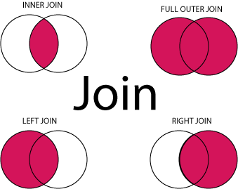

#  SQL JOINS
Week 6 | Lesson 2.1

### LEARNING OBJECTIVES
*After this lesson, you will be able to:*
- explain what a `JOIN` operation is
- visualize a `JOIN` operation as an operation between sets
- distinguish different types of `JOIN`
- perform `JOINS` in `SQL`

### STUDENT PRE-WORK
*Before this lesson, you should already be able to:*
- connect to a local or remote relational database
- perform SQL CRUD and queries
- merging dataframes with Pandas.merge

### INSTRUCTOR PREP
*Before this lesson, instructors will need to:*
- Read in / Review any dataset(s) & starter/solution code
- Generate a brief slide deck
- Prepare any specific materials
- Provide students with additional resources
- make sure the GA copy of the northwind database is available at:
        psql -h dsi.c20gkj5cvu3l.us-east-1.rds.amazonaws.com -p 5432 -U dsi_student northwind
        password: gastudents    

### LESSON GUIDE
| TIMING  | TYPE  | TOPIC  |
|:-:|---|---|
| 5 mins | [Opening](#opening) | Opening |
| 15 mins | [Introduction](#introduction) | Joining tables |
| 15 mins | [Demo](#demo) | Demo: Different types of JOIN |
| 15 mins | [Guided-practice](#guided-practice) | Guided Practice: Other Joins |
| 15 mins | [Demo](#demo_2) | Demo: Sub-queries |
| 15 minutes | [Ind-practice](#ind-practice) | Independent Practice: Other SQL Commands |
| 5 mins | [Conclusion](#conclusion) | Conclusion |

<a name="opening"></a>
## Opening (5 mins)
In the past week we learned many things about databases, including:

- how to connect to a local or remote db
- how to add, remove, edit data
- how to perform simple queries
- how to aggregate, group and sort data

**Check:** List the  SQL commands you learned last week.
> Answer: SELECT, CREATE, INSERT, DELETE, ALTER, UPDATE, ORDER BY, HAVING, LIKE, DISTINCT, LIMIT ...

However, in many occasions we needed to use data stored in more than one table. Last week we did this using `Pandas merge`, but time has come to learn about _`JOIN`_, which is the natural way to merge data within `SQL`.

<a name="introduction"></a>
## Joining tables (15 mins)

We will use the [Northwind sample database](https://northwinddatabase.codeplex.com/).

As you know, the instructions for connecting are:

    psql -h dsi.c20gkj5cvu3l.us-east-1.rds.amazonaws.com -p 5432 -U dsi_student northwind
    password: gastudents

We will use a few tables from this database, here is what they look like:

`customers`:

|CustomerID |CompanyName |ContactName | ContactTitle |Address|City | Region | PostalCode | Country |Phone | Fax|
|---|
|ALFKI| Alfreds Futterkiste| Maria Anders | Sales Representative | Obere Str. 57 | Berlin|| 12209| Germany | 030-0074321| 030-0076545|
|ANATR| Ana Trujillo Emparedados y helados | Ana Trujillo | Owner| Avda. de la Constitución 2222 | México D.F. || 05021| Mexico| (5) 555-4729 | (5) 555-3745|
|ANTON| Antonio Moreno Taquería| Antonio Moreno | Owner| Mataderos2312 | México D.F. || 05023| Mexico| (5) 555-3932 |
|...|...|...|...|...|...|...|...|...|...|...|

`orders`:

|OrderID | CustomerID | EmployeeID | OrderDate| RequiredDate | ShippedDate | ShipVia | Freight | ShipName|ShipAddress |ShipCity| ShipRegion | ShipPostalCode | ShipCountry |
|----|
|10248 | VINET|5 | 1996-07-04 | 1996-08-01 | 1996-07-16| 3 | 32.38 | Vins et alcools Chevalier | 59 rue de l'Abbaye | Reims|| 51100| France|
|10249 | TOMSP|6 | 1996-07-05 | 1996-08-16 | 1996-07-10| 1 | 11.61 | Toms Spezialitäten| Luisenstr. 48| Münster|| 44087| Germany|
|10250 | HANAR|4 | 1996-07-08 | 1996-08-05 | 1996-07-12| 2 | 65.83 | Hanari Carnes | Rua do Paço, 67| Rio de Janeiro | RJ | 05454-876| Brazil|
|...|...|...|...|...|...|...|...|...|...|...|

`order_details`:

| OrderID |  ProductID |  UnitPrice | Quantity | Discount |
| ----- |
|10248|11|14|12|0|
|10248|42|9.8|10|0|
|10248|72|34.8|5|0|
|10249|14|18.6|9|0|
|10249|51|42.4|40|0|
|10250|41|7.7|10|0|
|...|...|...|...|...|


### Normalized vs Denormalized data

There are several ways to organize data in a relational database. Two common definitions for data setups are: _normalized_ and _denormalized_.

_Normalized_ structures have a single table per entity, and use many foreign keys or link tables to connect the entities.

_Denormalized tables_ have fewer tables and may (for example) place all of the tweets and the information on users in one table.

Each style has advantages and disadvantages. _Denormalized_ tables duplicate a lot of information. For example, in our combined tweets/users table, we may store the address of each user. Now instead of storing this once per user, we are storing this once per tweet!  

However, this makes the data easy to access if we ever need to find the tweet along with the user's location.

_Normalized_ tables save the storage space by separating the information. However, if we ever need to access those two pieces of information, we would need to _join_ the two tables, which can be a fairly slow operation.


**Check:** Are the three tables above Normalized or Denormalized?
> Answer: Normalized

**Check:** Can you make an example of a de-normalized table derived from the ones above?
> Answer: e.g.
>
| OrderID |  ProductID |  UnitPrice | Quantity | Discount | CustomerID | EmployeeID | OrderDate| RequiredDate | ShippedDate | ShipVia | Freight | ShipName|ShipAddress |ShipCity | ShipPostalCode | ShipCountry |
| ----- |
|10248|11|14|12|0| VINET|5 | 1996-07-04 | 1996-08-01 | 1996-07-16| 3 | 32.38 | Vins et alcools Chevalier | 59 rue de l'Abbaye | Reims| 51100| France|
|10248|42|9.8|10|0| VINET|5 | 1996-07-04 | 1996-08-01 | 1996-07-16| 3 | 32.38 | Vins et alcools Chevalier | 59 rue de l'Abbaye | Reims| 51100| France|
|10248|72|34.8|5|0| VINET|5 | 1996-07-04 | 1996-08-01 | 1996-07-16| 3 | 32.38 | Vins et alcools Chevalier | 59 rue de l'Abbaye | Reims| 51100| France|
|10249|14|18.6|9|0| VINET|5 | 1996-07-04 | 1996-08-01 | 1996-07-16| 3 | 32.38 | Vins et alcools Chevalier | 59 rue de l'Abbaye | Reims| 51100| France|
|10249|51|42.4|40|0| VINET|5 | 1996-07-04 | 1996-08-01 | 1996-07-16| 3 | 32.38 | Vins et alcools Chevalier | 59 rue de l'Abbaye | Reims| 51100| France|
|10250|41|7.7|10|0| VINET|5 | 1996-07-04 | 1996-08-01 | 1996-07-16| 3 | 32.38 | Vins et alcools Chevalier | 59 rue de l'Abbaye | Reims| 51100| France|
|...|...|...|...|...|...|...|...|...|...|...|...|...|...|...|...|...|


### Joins

_SQL joins_ are used when data is spread in different tables. A _join_ operation allows to combine rows from two or more tables in a single new table. In order for this to be possible, a common field between the tables need to exist.

**Check:** where have you encountered a similar functionality in Pandas?
> Answer:  `merge` function in Pandas.

**Check:** can you make a couple of examples of how you used that Pandas function in the past?

Join operations can be thought of as operations between two sets, where records with the same key are combined and records missing in one set are either discarded or included as NULL values.


#### INNER JOIN
The most common type of join is: SQL INNER JOIN (simple join). An SQL INNER JOIN returns all rows from multiple tables where the join condition is met.

Let's consider a few columns of the `orders` table above:

|OrderID|CustomerID|OrderDate|
|---|---|---|
|10308|2|1996-09-18|
|10309|37|1996-09-19|
|10310|77|1996-09-20|

In the `customers` table, let's focus on these columns:

|CustomerID|CompanyName|ContactName|Country|
|---|---|---|---|
|1|Alfreds Futterkiste|Maria Anders|Germany|
|2|Ana Trujillo Emparedados y helados|Ana Trujillo|Mexico|
|3|Antonio Moreno Taquería|Antonio Moreno|Mexico|

Notice that the `CustomerID` column in the `Orders` table refers to the `CustomerID` in the `Customers` table. The relationship between the two tables above is the `CustomerID` column. We can thus _JOIN_ the two tables in order to obtain a table like the following:

|OrderID|CompanyName|OrderDate|
|---|---|---|
|10308|Ana Trujillo Emparedados y helados|9/18/1996|
|10365|Antonio Moreno Taquería|11/27/1996|
|10383|Around the Horn|12/16/1996|
|10355|Around the Horn|11/15/1996|
|10278|Berglunds snabbköp|8/12/1996|

Where the information contained in the two tables is _joined_ in a single table, using the common key of `CustomerID`.

**Check:** Restate in your own words what a `JOIN` operation is?

**Check:** Think back to what you've learned about _normalized_ and _non-normalized_ databases. In which case are `joins` more likely to be necessary?

#### Comparison with Pandas Merge

See [here](http://pandas.pydata.org/pandas-docs/stable/comparison_with_sql.html) for a comparison between pandas and SQL and [here](http://pandas.pydata.org/pandas-docs/stable/merging.html#database-style-dataframe-joining-merging) for an in depth review of Pandas merge.

<a name="demo"></a>
## Demo: Different types of JOIN (15 mins)
Given the two tables above, we would like to produce a new table that looks like this:

|OrderID|CompanyName|OrderDate|
|---|---|---|
|10308|Ana Trujillo Emparedados y helados|9/18/1996|
|10365|Antonio Moreno Taquería|11/27/1996|
|10383|Around the Horn|12/16/1996|
|10355|Around the Horn|11/15/1996|
|10278|Berglunds snabbköp|8/12/1996|

where the `OrderID` and `OrderDate` come from the `orders` table and the `CompanyName` comes from the `customers`table. This can be achieve in `SQL` simply using the next statement:


```sql
    SELECT orders."OrderID", customers."CompanyName", orders."OrderDate"
    FROM orders
    INNER JOIN customers
    ON orders."CustomerID"=customers."CustomerID";
```

An `INNER JOIN` takes the intersection of the two datasets, excluding the rows for which `CustomerID` is null in either of the two tables.

There are several types of join operations.

- INNER JOIN: Returns all rows when there is at least one match in BOTH tables
- LEFT JOIN: Return all rows from the left table, and the matched rows from the right table
- RIGHT JOIN: Return all rows from the right table, and the matched rows from the left table
- FULL JOIN: Return all rows when there is a match in ONE of the tables

It is much easier to understand joins as operations of intersection of sets. In-fact, there's a matematically sound theory behind, called [Relational Algebra](https://en.wikipedia.org/wiki/Relational_algebra), which we won't expand on here, but it's very interesting if you're math inclined.




**Check:** Come up with a couple of examples of where you may want to use a different type of join.


### Left Join

The LEFT JOIN keyword returns all rows from the left table (table1), with the matching rows in the right table (table2). The result is NULL in the right side when there is no match.


#### Left Join Syntax
```sql
SELECT column_name(s)
FROM table1
LEFT JOIN table2
ON table1.column_name=table2.column_name;
```

**Check:** Consider the JOIN we performed above between `orders` and `customers`. Which side could contain NULL values in the joined table if we performed a LEFT JOIN?
> Answer: there could be NULL values in the `customers` columns

### Right Join

Similarly, the RIGHT JOIN keyword returns all rows from the right table (table2), with the matching rows in the left table (table1). The result is NULL in the left side when there is no match.

#### Right Join Syntax
```sql
SELECT column_name(s)
FROM table1
RIGHT JOIN table2
ON table1.column_name=table2.column_name;
```
**Check:** Consider the JOIN we performed above between `orders` and `customers`. Which side could contain NULL values in the joined table if we performed a RIGHT JOIN?
> Answer: there could be NULL values in the `orders` columns

### Full (outer) Join

The FULL OUTER JOIN keyword returns all rows from the left table (table1) and from the right table (table2). The FULL OUTER JOIN keyword combines the result of both LEFT and RIGHT joins. In this case we could have NULL values on both sides.

#### Full Join Syntax

```sql
SELECT column_name(s)
FROM table1
FULL OUTER JOIN table2
ON table1.column_name=table2.column_name;
```


<a name="guided-practice"></a>
## Guided Practice: Other Joins (15 mins)

If you remember in lab 3.2, we explored the products, orders and customers tables. However we had to use `pandas.merge` in order to answer questions containing data from multiple tables. Let's see if we can solve them in pure `SQL` now. 

> Instructor note: proceed by asking them a question, giving them a few minutes to work on it an then show the solution.

1. How many products per category does the catalog contain? Print the answer with the `CategoryName`, and `Count`.
> Answer:
```sql
SELECT "CategoryName", count("ProductID")
FROM products AS p
JOIN categories AS c
ON p."CategoryID" = c."CategoryID"
GROUP BY c."CategoryName"
```
- What 5 customers are generating the highest revenue? Print a table with `CustomerID` and `Total Revenue`. You will need to use data from 3 tables.
Answer:
```sql
SELECT c."CustomerID",
       CAST(
       SUM("UnitPrice" *
           "Quantity" *
           (1.0 - "Discount"))
      AS numeric(36,2)) 
      AS "Revenue"
FROM customers AS c
JOIN orders AS o
ON c."CustomerID" = o."CustomerID"
JOIN order_details AS od
ON o."OrderID" = od."OrderID"
GROUP BY c."CustomerID"
ORDER BY "Revenue" DESC
LIMIT 5
```
- In which country are the top 5 suppliers by number of units supplied? Print a table with the supplier's `CompanyName`, `Country` and total number of units supplied.
>Answer:
```sql
select s."CompanyName", s."Country", sum(od."Quantity") AS "UnitsSupplied"
FROM orders o
JOIN order_details as od
ON o."OrderID" = od."OrderID"
JOIN products p
ON od."ProductID" = p."ProductID"
JOIN suppliers s
ON s."SupplierID" = p."SupplierID"
GROUP BY s."SupplierID"
ORDER BY "UnitsSupplied" DESC
LIMIT 5

```


<a name="demo_2"></a>
## Demo: Sub-queries (15 mins)

SQL is very versatile and it can be stretched a bit further than simple JOIN operations between two different tables.

### Subqueries

A _Subquery_ or _Inner query_ or _Nested query_ is a query within another SQL query. It is used to further restrict the data to be retrieved by returning data that will be used in the main query as a condition.

Subqueries can be used with the SELECT, INSERT, UPDATE, and DELETE statements along with the operators like =, <, >, >=, <=, IN, BETWEEN etc.


#### Syntax

Here is an example of a subquery. The table resulting from the subquery is used as condition in the `WHERE` condition of the main query.

```sql
SELECT column_name1
    FROM table_name1
    WHERE column_name2 [Comparison Operator]
        (SELECT column_name3
         FROM table_name2
         WHERE condition);
```

For example, let's extract all the `orders` from `customers` based in France.

```sql
SELECT "OrderID", "CompanyName", "OrderDate", FROM orders
WHERE "CustomerID" =
(SELECT "CustomerID"
 FROM customers
 WHERE "Country" = "France")
```

**Check:** Note that one can get to the same result with a `JOIN` operation. What would be the syntax of the command in that case?

```sql
SELECT * FROM orders
WHERE "CustomerID" =
(SELECT "CustomerID"
 FROM customers
 WHERE "Country" = "France")
```


<a name="ind-practice"></a>
## Independent Practice: Other SQL Commands (15 minutes)

Work in pairs: go to http://www.w3schools.com/sql and choose a command you have not hear of. Read about it for 5 minutes, then explain it to your pair (take 2.5 minutes turns).

Use the last 5 minutes to share some interesting finds with the rest of the class.


<a name="conclusion"></a>
## Conclusion (5 mins)

In this class we have started to discover the full power of Relational databases through JOINs and sub-queries. These allow us to mix and match data from various tables, in order to extract meaningful results.

**Check:** Can you think of situations where this could be useful in a business context?
> Examples:
- business manager aggregating data from production and product
- product manager conducting an A/B test and combining data from website usage with data from product db
- ...

### ADDITIONAL RESOURCES

- [SQL Join Documentation](http://www.w3schools.com/sql/sql_join.asp)
- [Relational Algebra](https://en.wikipedia.org/wiki/Relational_algebra)
- [Wikipedia on JOINS](https://en.wikipedia.org/wiki/Join_(SQL))

