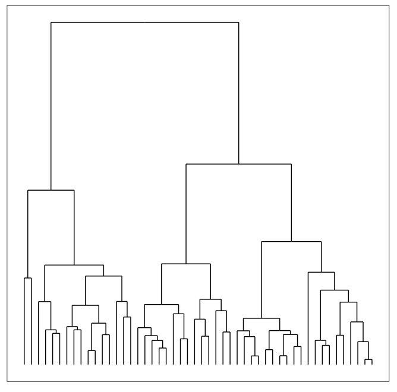
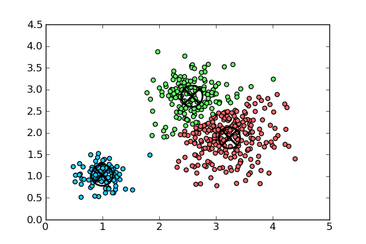
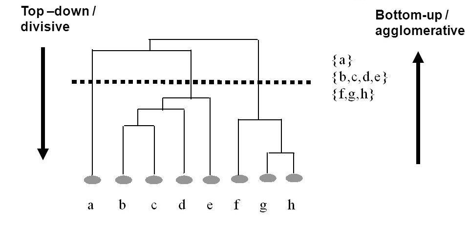
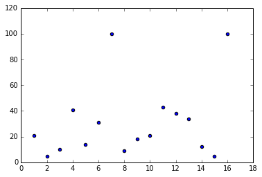
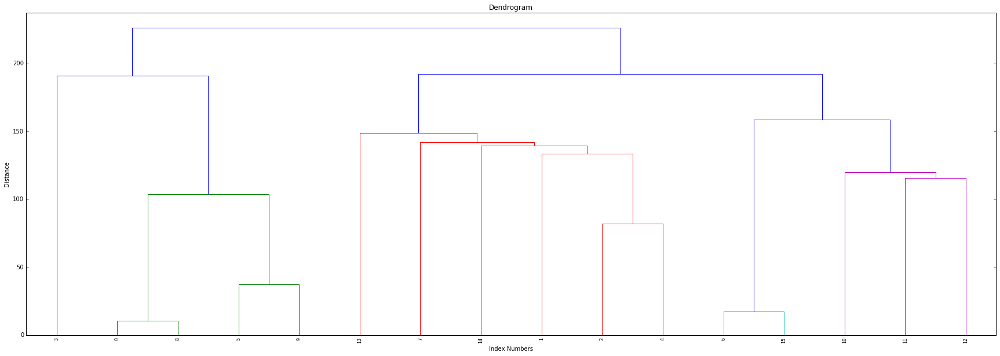
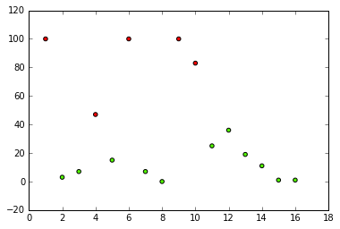

#  Intro to Hierarchical Clustering
Week 7 | Lesson 3.2

### LEARNING OBJECTIVES
*After this lesson, you will be able to:*
- Perform a Hierarchical Clustering
- Plot, Analyze, and Understand the Dendrogram
- Evaluate clusters for fit 


### STUDENT PRE-WORK
*Before this lesson, you should already be able to:*
- Perform clustering analyses in python
- Have a working knowledge of Pandas and SciPy

### INSTRUCTOR PREP
*Before this lesson, instructors will need to:*
- Prepare the starter and solution code on their local machine

### LESSON GUIDE
| TIMING  | TYPE  | TOPIC  |
|:-:|---|---|
| 5 min  | [Opening](#opening)  | Opening |
| 10 min  | [Introduction](#introduction)   | What is Hierarchical Clustering?  |
| 15 min  | [Demo](#demo)  | Example of Hierarchical Clustering  |
| 25 min  | [Guided Practice](#guided-practice<a name="opening"></a>)  | Hierarchical Clustering in Python |
| 25 min  | [Independent Practice](#ind-practice)  | Implement hierarchical clustering
| 5 min  | [Conclusion](#conclusion)  | Conclusion  |

---

<a name="opening"></a>
## Opening (5 mins)

>: Instructor Note: Ask students to recall previous methods of clustering; include a real world hook

- Hierarchical clustering works well for non-spherical clusters
- It also works well on smaller datasets - this algorithm has a longer computational time and doesn't work well for larger datasets
- Hierarchical clustering works well for instances where we are working with observed records. For instance - I've tallied the amount of times a certain skill exists in a collection of resumes. Since k-means computes *means*, this wouldn't give us very good clusters!

**Check:** Ask students to recall k-means clustering and what type of data we might apply k-means on

<a name="introduction"></a>
## Introduction: Intro to Hierarchical Clustering (10 mins)

#### What is Hierarchical Clustering? 

Hierarchical clustering, like k-means clustering, is another common form of clustering analysis. With this type of clustering - we seek to do exactly what the name suggests: build hierarchies of links that ultimately form clusters. Once these links are determined, they are displayed in what is called a **dendrogram** - a graph that displays all of these links in a hierarchical manner.



To find clusters in a dendrogram, we can cut the graph to find the clusters - we'll go over this later in the lesson. 

#### How is Hierarchical Clustering Different from K-Means Clustering? 

Much like we learned about k-means clustering, hierarchical clustering is another method for classifying our data. If you recall, in k-means clustering, the algorithm groups data into a pre-defined set of clusters based on various attributes. However in the case of hierarchical clustering, the algorithm builds classifications trees of the data that merges groups of similar data points.

With k-means, the boundaries between the various clusters are distinct and independent (see graph), whereas in hierarchical clustering, there are shared similarities between those groups that are represented by the classification tree.  Going further - unlike with k-means, hierarchical clustering does not require you to define "k" as an input.



All of these attributes can lend themselves to certain clustering situations - for instance, hierarchical clustering is more beneficial for smaller datasets - think about the complexity of a dendrogram from a 1000 point dataset! Likewise, this form of clustering works better when we have binary data or dummy variables: as k-means computes *means* in forming clusters, performing k-means on a dataset with a significant amount of variables would skew the resulting clusters and distributions. 


**Check:** How is clustering different from classification? When might we use one over the other? 

<a name="demo"></a>
## How Does Hierarchical Clustering Work? - Demo (10 mins)

In hierarchical clustering, instead of clustering in one step, the clusters are determined in the a varying number of partitions. At each step, it makes the best choice based on the surrounding datapoints, with the ultimate goal that these best choices will lead to the best choice of clusters overall. Given the algorithm's method of calculating linkages based on immediate datapoints, it's known as a **greedy algorithm**.

There are two forms of hierarchical clustering; **agglomerative hierarchical clustering** and **divisive hierarchical clustering**.



Today, we're going to look at one of the most fundamental methods for agglomerative hierarchical cluster, known as **linkage clustering**. Linkage clustering iterates through datapoints and computes the distance between groups by computing the distance between two neighboring datapoints, using the **nearest neighbor** technique that was also used by KNN.

To think about the difference between agglomerative vs divisive, with the former we start with the leaves of the tree and build the trunk, and with the latter we start with the trunk of the tree and build the leaves. Both methods are applicable when using hierarchical clustering, it's just a matter of computational preference!

#### Hierarchical Clustering in Python

Implementing hierarchical clustering in python is as simple as calling a function from the SciPy toolbox:

```python
Z = linkage(X, 'ward')
```

Here, "X" represents the matrix of data that we are clustering, and "ward" tells our algorithm which method to use to calculate distance between our newly formed clusters - in this case **Ward's Method** which seeks to minimize the variance when forming clusters. When calculating distance, the default is **Euclidean distance** which we learned about in our dimensionality reduction lesson.

After we cluster, we can calculate the dendrogram using a simple ```dendrogram()``` function from SciPy, which we can then draw using our handy  ```plt``` from matplotlib. 

To check how well our algorithm has measured distance, we can calculate the **cophenetic correlation coefficient**. This metric, which measures the height of the dendrogram at the point where two branches merge, can tell us how well the dendrogram has measured the distance between data points in the original dataset and is a helpful measure to see how well our clustering test has run. 

```python
c, coph_dists = cophenet(Z, pdist(X))
```

Here, we call the cophenetic function using ```cophenet``` from SciPy and apply it to our clustered set, Z, and the distance of our original set, X. 

**Check:** What is the cophenetic coefficient? How does it relate to the dendrogram? 

<a name="guided-practice"></a>
## Guided Practice: Preparing Your Analysis & Handling Data (15 mins)

>: Instructor Note: Spin up a new Ipython notebook to run the code in.

Let's say that you're asked to perform hierarchical clustering analysis on a new dataset - how would we go about it?

We're going to be using a dataset that details [language skills](.assets/datasets/lang.csv) from different European countries. We will perform a hierarchical clustering analysis on this dataset. 

You might be faced with a situation like this is you were asked to tackle demographic info or survey responses, so it's a useful test!

**Check**: Can you think of some other examples for how this type of data could be used?

First; Let's setup our imports in a new Ipython notebook: 

```python
from matplotlib import pyplot as plt
from scipy.cluster.hierarchy import dendrogram, linkage, cophenet
from scipy.spatial.distance import pdist
import numpy as np
import pandas as pd
import os
from scipy.cluster.hierarchy import fcluster, cophenet

%matplotlib inline
```

We're going to be using **scipy** for our analysis. Let's load in the dataset using Pandas ```read.csv``` and check the head to see it's structure

```python
lang = pd.read_csv(".../lang.csv")
lang.head()
```

First, let's plot our data to visually examine the clusters. 

```python
plt.scatter(lang['country'], lang['english'])
plt.show()
```




Check: How many clusters do you think we have?
> Note: Initially, it looks like we may have two clusters.


Now, let's convert our data to a matrix to pass to the clustering algorithm - the matrix makes it easier for our algorithm to compute distance:

```python
X = df.as_matrix(columns=None)
```

Next, we'll implement the actual clustering algorithm using the `ward` method:

```python 
Z = linkage(X, 'ward')
```

Now, we can calculate the cophenetic correlation coefficient to see how well our algorithm has measured the distances between the points:

```python
c, coph_dists = cophenet(Z, pdist(X))
```

To see the coefficient, just type in the variable: 

```python
c
```
You should see a C around **0.667**, which means that the distances of the clusters are moderately related to the original distances of the data.

Now, let's plot the dendrogram. To do this, we call ```dendrogram``` from  ```scipy.cluster.hierarchy``` and input our links, and rotate the labels so we can view the graph in a more organized matter. We can then plot the denrogram with pyplot from matplotlib.  

```python
plt.title('Dendrogram')
plt.xlabel('Index Numbers')
plt.ylabel('Distance')
dendrogram(
    Z,
    leaf_rotation=90.,  
    leaf_font_size=8.,
)
plt.show()
```



Now, we want to determine our clusters. While there are many ways to automate this process,  we're going to help estimate our clusters by visually examining the graph to better understand the structure of the dendrogram. 

Here, we can see that no links exist above a distance of 200 - so we will set maximum distance at 200 and use the ```fclusters``` function from ```scipy.cluster.hierarchy```, which will return our cluster ID's. 

```python
max_dist = 200
clusters = fcluster(Z, max_dist, criterion='distance')
clusters
```

Lastly, let's plot our data and assign the class labels as the color:

```python
plt.scatter(X[:,0], X[:,6], c=clusters, cmap='prism')
plt.show()
```

We should get a graph that looks similar to this: 





**Check:** Were you able to successfully run your own code? Does it match the instructors' results? 

<a name="ind-practice"></a>
## Independent Practice: Perform a Hierarchical Clustering Analysis (15 minutes)

> Instructor Note: This can be a pair programming activity or done independently.

Now that we've walked through the process of clustering, it's time to try it on your own. We're going to be working with the iris data set, and your job is to cluster the data to understand their various attributes.

Open the [data](./assets/datasets/iris.csv) and [starter code](./code/starter-code.ipynb) and try to work through both exercises with a partner. Do your best!

**Check:** Were you able to perform the clustering analysis effectively? Does your dendrogram look like the instructors' dendrogram?

<a name="conclusion"></a>
## Conclusion (5 mins)
- Recall the definitions of linkage, cophenetic coefficient, and dendrogram
- Recap and recall the process steps in hierachical clustering
    - Linkage: First, we create the linkages in python that form the basis of our analysis
    - Cophenetic Coefficient: We find the cophenetic coefficient to determine how well our analysis is running
    - Dendrogram: We plot the dendrogram and visually inspect the clusters
    - Lastly, we find our cluster ID's and plot

***

## Additional Resources 

- [SciPy Documentation for Linkage techniques](http://docs.scipy.org/doc/scipy-0.16.0/reference/generated/scipy.cluster.hierarchy.linkage.html)
- [What even is this Hierarchical Clustering Thing, Anyway?](http://www.saedsayad.com/clustering_hierarchical.htm)
