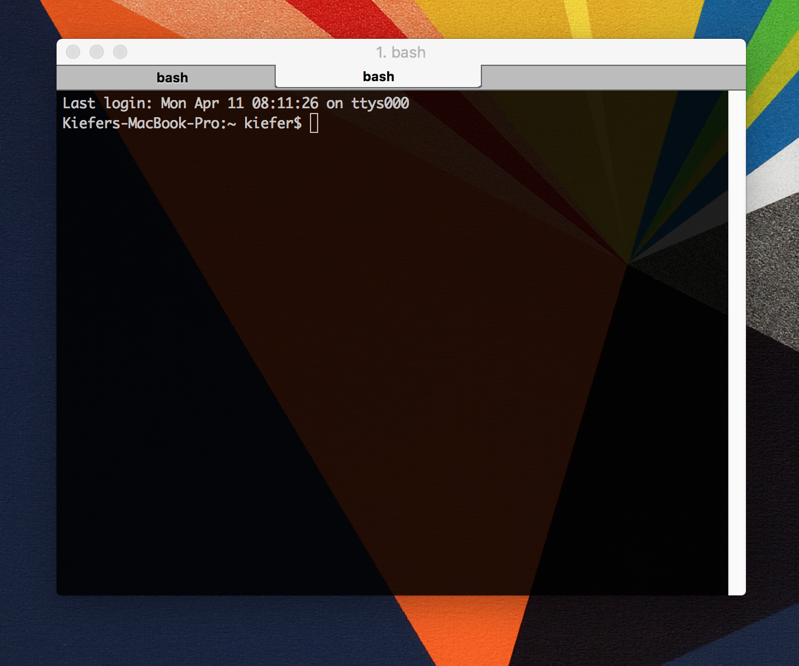

#  Using the Command Line
Week 1 | Lesson 1.1

### LEARNING OBJECTIVES
*After this lesson, you will be able to:*
- Create folders and files using the command line (**mkdir**, **touch**)
- Change directories and list directory contents (**cd**, **ls**)
- Check current working directly (**pwd**)
- Remove files and directories (**rm**)


### STUDENT PRE-WORK
*Before this lesson, you should already be able to:*
- [GA pre-work](http://generalassembly.github.io/prework/cl/#/)
- Know how to open the terminal
- Familiarize yourself with the UNIX commands **cd**, **pwd**, **mkdir**, **pwd**, **rm** and **touch**.

[1]: http://mally.stanford.edu/~sr/computing/basic-unix.html "UNIX"


### INSTRUCTOR PREP
*Before this lesson, instructors will need to:*
- As soon as you know how many students there are, register for Tableau licenses using this
[link](https://generalassembly.atlassian.net/wiki/pages/viewpage.action?pageId=28378131)
- Students need to register too


### LESSON GUIDE
| TIMING  | TYPE  | TOPIC  |
|:-:|---|---|
| 10 min  | [Introduction](#introduction)   | What is a GUI (pronounced gooey)?   |
| 40 min  | [Codealong](#demo)  | Forget Finder, get fast at using your laptop  |
| 20 min  | [Codealong](#demo)  | Paths |
| 10 min  | [Independent Practice](#ind-practice)  |   |
| 10 min  | [Conclusion](#conclusion)  |  |


<a name="introduction"></a>
##  What is a GUI (pronounced gooey)? (5 mins)
There was a point when computers didn't come with a Graphical User Interface (GUI). Instead, everyone interacted with the computer using text commands in what we call a Command Line Interface (CLI).



Today, the command line still exists, even though you may have never seen it as a casual computer user. Knowing how to use the CLI becomes essential as you program more.

#### What is a shell?

A shell is simply a type of command line program. It contains a very simple, text-based user interface enabling you to access all of an operating system's services. It is essentially a text interpreter that translates your typed commands into functions that the operating system runs.

*Taken from Just for fun: [Type like a hacker](http://hackertyper.com/)*

Here are a few Windows equivalents:
[Cygwin](https://www.cygwin.com/)
[msis git](https://msysgit.github.io/)

[Windows shell equivalents](http://stackoverflow.com/questions/28487128/what-program-in-windows-is-equivalent-to-oss-terminal)

**Check:** What is a GUI? What is a CLI? What is a shell?

------
## Forget Finder, get fast at using your laptop - Codealong (40 mins)

##### Opening and closing the terminal

Spotlight in OSX is the easiest and fastest way to open the terminal:

- ⌘ (Command) + Space
- "Terminal"
- Enter

Notice that you can actually hit enter as soon as the field autocompletes. Get used to taking shortcuts – don't type the whole word out if you don't have to and avoid using your mouse if you can open or use an app with just keyboard shortcuts. It may seem harder now, but when you get used to it, it will save you literally hours of cumulative time.

##### Getting comfortable in the CLI

1. For many programs, you can open multiple tabs by pressing **⌘-T**.
  - Try it in your terminal!
2. You can close the current tab or window with **⌘-W**. This goes for most applications on a Mac.
  - Try _that_ in your terminal!
3. If you have a process running, you can quit it by pressing **Ctrl-C**. Let's try that now.

  - At the command line, type `ping 127.0.0.1`. This basically sends a message to your own computer asking if it's awake.
  - Notice that it will keep pinging, even if you type something.
  - To stop the currently-running script, press **Ctrl-C**.

4. To quit the command line altogether, you can press **⌘-Q**.

**Check** Try pinging google.com in the terminal. How do you stop pinging google?

[Here](http://ss64.com/nt/syntax-keyboard.html) are some equivalent Windows shortcuts.

———

## Paths - Codealong (20 mins)

Every file or folder in a file system can be read, written, and deleted by referencing its position inside the filesystem.

When we talk about the position of a file or a folder in a file system, we refer to its "path". There are a couple of different kinds of paths we can use to refer to a file: the **absolute path** and the **relative path**.

**Directory** is an important term that's used interchangeably with **folder**. Though they are not exactly the same thing, when we say "navigate to your project directory" think of this as "navigate to your project folder".  Here's a little more information:

_Strictly speaking, there is a difference between a directory which is a file system concept, and the graphical user interface metaphor that is used to represent it (a folder)...If one is referring to a container of documents, the term folder is more appropriate. The term directory refers to the way a structured list of document files and folders is stored on the computer. It is comparable to a telephone directory that contains lists of names, numbers and addresses and does not contain the actual documents themselves._

*Taken from [Close-To-Open Cache Consistency in the Linux NFS Client](http://www.citi.umich.edu/projects/nfs-perf/results/cel/dnlc.html)*

##### What is an absolute path?

An absolute path is defined as the specific location of a file or folder from the root directory, typically shown as `/`. The root directory is the starting point from which all other folders are defined and is not normally the same as your **Home** directory, which is normally found at `/Users/[Your Username]`.

##### Working with unix commands and file paths

Typing `cd` - a command for "change directory" with no parameters takes us to our home directory.

```bash
cd
```

If we type in `pwd` - a command for "print working directory" from that folder, we can see where we are in relation to the root directory. The `pwd` command will always give you the absolute path of your current location.

An example of absolute path:

```bash
open /Users/Lucy/desktop/a/b/c/file.txt
```

Notice, this path starts from `/` directory which is a root directory for every Linux/Unix machines.

##### What is a relative path?

> *Note:* Instructors – customize this lesson to demo with folders that you have present on your filesystem, or alternatively create a similar file structure on the fly.

A relative path is a reference to a file or folder **relative** to the current position, or the present working directory(pwd). If we are in the folder `/a/b/` and we want to open the file that has the absolute path `/a/b/c/file.txt`, we can just type:

```bash
open c/file.txt
```

or

```bash
open ./c/file.txt
```

At any time, we can also use the absolute path, by adding a slash to the beginning of the path. The absolute path is the same for a file or a folder regardless of the current working directory, but relative paths are different, depending on what directory we are in.  Directory structures are laid out like `directory/subdirectory/subsubdirectory`.

**Check:**  What is the difference between an absolute path and a relative path?


#### Navigating using the command prompt

The tilde `~` character is an alias to your home directory. Use it to quickly return home.

```bash
cd ~\
```

Or even more simply, you can just type:

```bash
cd
```

The tilde `~` character is useful to shorten paths that would otherwise be
absolute paths. For example, to navigate to your Desktop you can type:

```bash
cd ~/Desktop
```

The `ls` command lists files and directories in the current folder.
```bash
ls
```

It can also be used to list files located in any directory. For example to list
your applications you can type:
```bash
ls /Applications
```

To make a new directory.
```bash
mkdir folder
```

To create a new file.
```bash
touch file1
```

To remove a file.
```bash
rm file1
```

To remove a directory/folder, we need to add a **flag** to the rm command.
```bash
rm -r folder/
```

What is the **-r** flag? It stands for "recursive". It's not important to get into the technicalities of this right now, but essentially it is telling the remove command to get rid of the folder and anything within the folder at any "depth". Even if a folder is empty, the OS requires the recursive flag for deleting it.

##### Using wildcards in the command prompt

The wildcard symbol `*` is useful for using commands to operate on multiple
files. To give an example first create a folder on your Desktop and add some
files.
```bash
mkdir ~/Desktop/example_folder
cd ~/Desktop/example_folder
touch cat.txt
touch dog.txt
touch bird.txt
touch fish.txt
```

You can use the wildcard `*` to then operate on subsets of files. List any
file with "i" in the filename, for example:
```bash
ls *i*
```

Or remove any file with "d":
```bash
rm *d*
ls
```

**Check:**  What's a quick way to get back to your home directory?

<a name="independent practice"></a>
## Independent Practice: Topic (10 minutes)
Try out the **mkdir**, **touch**, **cd**, **pwd**, **rm**, and **ls** commands on your own. If you want, try out using the wildcard command.

<a name="conclusion"></a>
## Conclusion (5 mins)		 
Today we learned about the CLI commands mkdir, touch, cd, pwd, and ls. We also about absolute and relative paths.
Take a breather and then keep practicing. The more you practice the more comfortable you'll get!
